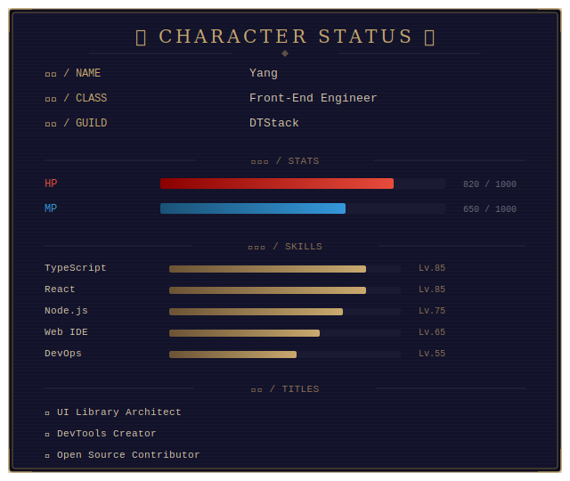

<h1 align="center">

    _Hi. There._

</h1>

<div align="center">

```
        ▄▄▄▄▄▄▄▄▄▄▄▄
      ▄▀▀▀▀▀▀▀▀▀▀▀▀▀▀▄
     █▌   ▄▄▄   ▄▄▄   ▐█
     █▌   ███   ███   ▐█
     █▌   ▀▀▀   ▀▀▀   ▐█
     █▌                 ▐█
      █▄     ████     ▄█
       ▀█▄▄         ▄▄█▀
          ▀█████████▀
```



</div>

<br>

<div align="center">


</div>

<br>

<div align="center">
  
  
</div>
