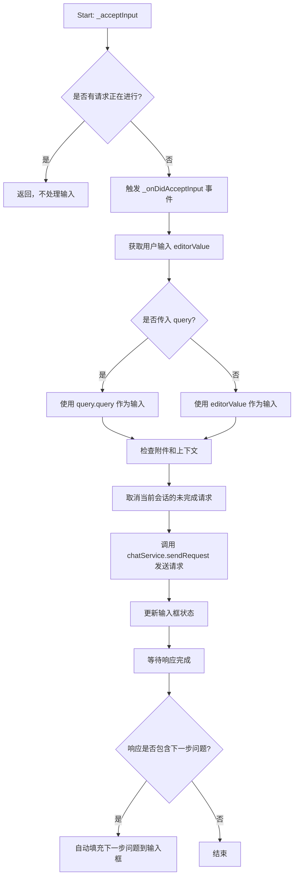
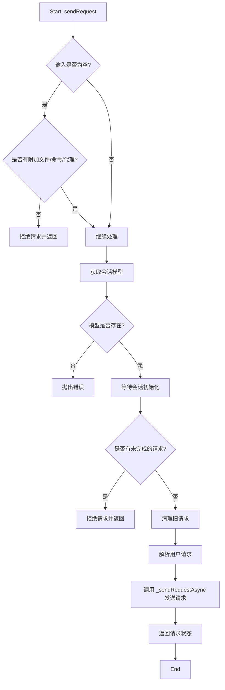
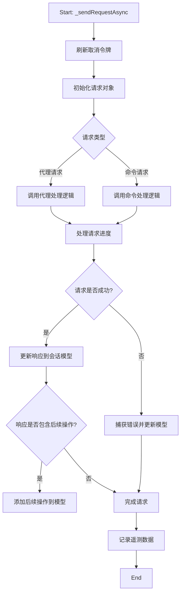
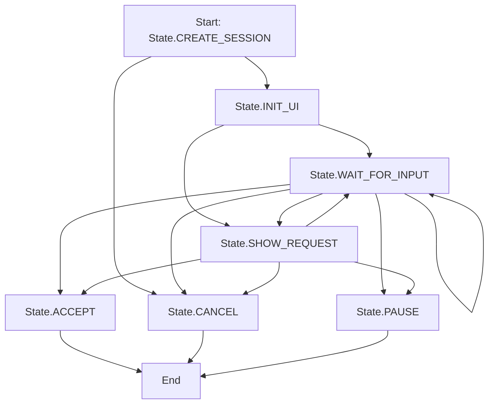

>[!note]
> It's generated by Github Copilot.

# VSCode-chat

chat 作为 VSCode 中的 contrib 进行加载。

## 目录
1. [Chat 界面初始化](#chat-界面初始化)
2. [发送消息](#发送消息)
   - [acceptInput](#acceptinput)
   - [sendRequest](#sendrequest)
   - [_sendRequestAsync](#_sendrequestasync)
3. [消息渲染](#消息渲染)
4. [inlineChat](#inlinechat)
   - [StartSessionAction](#startsessionaction)
   - [InlineChatController](#inlinechatcontroller)
5. [总结](#总结)

## Chat 界面初始化

详见 [VSCode-view](./[Copilot]VSCode-view.md)。

Chat 界面的创建逻辑通过 `ChatViewPane` 类在 `ViewPaneContainer` 中被实例化，并执行 `render` 方法，最终调用 `renderBody` 方法。以下是主要步骤：

1. 实例化 `ChatViewWelcomeController` 类，处理欢迎界面逻辑。
2. 创建 `scopedInstantiationService`，并重写 `ContextKeyService`。
3. 使用 `scopedInstantiationService` 实例化 `ChatWidget` 类。
4. 执行 `ChatWidget` 的 `render` 方法。
5. 获取缓存的 `ChatModel`，如果不存在，则通过 `chatService` 的 `startSession` 方法新建，并更新 `ChatWidget` 的相关数据。

相关代码如下：

```typescript
export class ChatViewPane extends ViewPane implements IViewWelcomeDelegate {
    ...
    protected override async renderBody(parent: HTMLElement): Promise<void> {
		try {
            ...
			this._register(this.instantiationService.createInstance(ChatViewWelcomeController, parent, this, this.chatOptions.location));

			const scopedInstantiationService = this._register(this.instantiationService.createChild(new ServiceCollection([IContextKeyService, this.scopedContextKeyService])));
            ...
			this._widget = this._register(scopedInstantiationService.createInstance(ChatWidget, ...);
            ...
			const info = this.getTransferredOrPersistedSessionInfo();
            ...
			const model = info.sessionId ? await this.chatService.getOrRestoreSession(info.sessionId) : undefined;

			await this.updateModel(model, info.inputValue || info.mode ? { inputState: { chatMode: info.mode }, inputValue: info.inputValue } : undefined);
		} catch (e) {
			this.logService.error(e);
			throw e;
		}
	}
    ...
	private async updateModel(model?: IChatModel | undefined, viewState?: IChatViewState): Promise<void> {
        ...
		model = model ?? (
                this.chatService.transferredSessionData?.sessionId && 
                this.chatService.transferredSessionData?.location === this.chatOptions.location
			        ? await this.chatService.getOrRestoreSession(this.chatService.transferredSessionData.sessionId)
			        : this.chatService.startSession(this.chatOptions.location, CancellationToken.None)
            );
        ...
		this._widget.setModel(model, { ...this.viewState });
        ...
	}
}
```

## 发送消息

无论是通过快捷键、点击发送按钮，还是通过下拉菜单发送消息，最终都会触发 `SubmitAction` 的 `run` 方法。具体参考 [VSCode-action](./[Copilot]VSCode-action.md)。

```typescript
abstract class SubmitAction extends Action2 {
	run(accessor: ServicesAccessor, ...args: any[]) {
		...
		const widgetService = accessor.get(IChatWidgetService);
		const widget = context?.widget ?? widgetService.lastFocusedWidget;
		widget?.acceptInput(context?.inputValue);
	}
}
```

### acceptInput



- 首先，判断是否有请求正在进行，如果有，则直接返回，不处理输入。
- 获取发送的消息，这里的逻辑是 `query ?? editorValue`。
	- 如果参数有 query 表示非用户输入，否则是用户输入
- 然后处理 attachment files 并获取为 attach context
- 【跳过】然后是一段 Edit 下才会触发的逻辑，这里暂时跳过
- 执行 `sendRequest` 方法，携带的参数有：当前对话的 sessionId、发送的消息、配置项
	- 配置项包括：**当前的 mode**、**选择的 model**、当前 chat 所在的面板及相关数据、上下文、attachContext 以及其他
- 【`inputPart.acceptInput`】如果是用户输入，则需要把输入项加载到 history 中
- 在某些特定的情况下，如果响应包含下一步问题，则会自动填充到输入框中
- 最后，响应完成

### sendRequest



- 如果输入为空但是存在 hasPromptFileAttachments，则添加默认的输入
- 针对一些异常情况的报错
- 基于 sessionId 获取 ChatModel
- 针对输入的文案进行解析
	- 输入的文案可以是 `/xxx`，也可以是 `@codebase`，或者是 `#xxx`，或者普通文案之类，这里借助 ChatRequestParser 类进行解析
- 继续获取 agent
	- 这个 agent 的含义是，譬如在文案中存在 @vscode，则 agent 为 vscode 的 Agent 对象。抑或文案中存在 @terminal，则 agent 为 terminal 的 Agent 对象。
	- 如果没有 agent，则会用一些逻辑去获取默认的 agent。比如上一次回答的 agent 继续沿用之类的。
- 执行 _sendRequestAsync 方法
	- 非 async 方法，防止阻塞真正的请求
	- 传入的参数包括 ChatModel、sessionId、解析后的 Request，attempt，agent，配置项之类的。

### _sendRequestAsync



- 准备请求相关的东西，比如**取消令牌**、**停止监听**、**响应类**
- 区分 agent 请求还是 command 请求
	- agent 请求：生成发起请求的参数
		- 在准备的过程中会生成 ChatRequestModel 类，并把其添加到 model 中
		- 调用 invokeAgent 发起请求
	- command 请求：调用 command
- 处理请求的进度
	- 这里会调用 `progressCallback` 方法，传入的参数是一个 `IChatProgress` 对象

>[!note]
> 这里有点没看懂，在调用 invokeAgent 的时候会调用已注册的 agent 上的 impl 的 invoke 方法。
> 在 ChatSetup 中会去注册相关的 agent，其中 invoke 方法会通过 accessor 获取 ChatService，然后一路往下传
> 直到调用到 doForwardRequestToCopilotWhenReady 函数，在判断 LanguageModelReady 以及 AgentReady 之后，会调用 `chatService.resendRequest`
> 而这里的 resendRequest 是 chatService 类的方法，上面的 sendRequest 方法也是 chatService 方法，最后又调用到 _sendRequestAsync 方法

## 消息渲染

与 [Chat 界面初始化](#chat-界面初始化) 类似，消息渲染的逻辑也在 `ChatWidget` 的 `render` 方法中。

```typescript
export class ChatWidget extends Disposable implements IChatWidget { 
	...
	render(parent: HTMLElement): void {
		...
		this.createInput(this.container, { renderFollowups, renderStyle });
		...
		this.renderWelcomeViewContentIfNeeded();
		this.createList(this.listContainer, { ...this.viewOptions.rendererOptions, renderStyle });
		...
	}
	...
}
```

`createList` 方法会创建一个 `ListView`，并传入 `ChatWidget` 的 `renderStyle` 作为参数。

```typescript
export class ChatWidget extends Disposable implements IChatWidget { 
	...
	private createList(listContainer: HTMLElement, options: IChatListItemRendererOptions): void {
		// 初始化相关 Service 和 Delegate
		...
		// 初始化 dom element
		...
		// 初始化 renderer
		this.renderer = this._register(scopedInstantiationService.createInstance(ChatListItemRenderer,...));
		// 初始化界面
		this.tree = this._register(scopedInstantiationService.createInstance(WorkbenchObjectTree, ..., [this.renderer], ...))
		...
	}
	...
}
```

WorkbenchObjectTree 是 VSCode 中的一个树形控件，它继承自 ObjectTree（继承自抽象类 AbstractTree）。在抽象类中实现了大部分交互逻辑，而渲染逻辑需要通过渲染器注入进去。

渲染器的核心函数为 renderTemplate 和 renderElement 方法。前者用于渲染树节点的布局模板，后者用于渲染树节点的内容。

具体渲染内容见 renderElement 方法。

```typescript
export class ChatListItemRenderer extends Disposable implements ITreeRenderer<ChatTreeItem, FuzzyScore, IChatListItemTemplate> {
	...
	// 这里的 templateData 就是 renderTemplate 返回的数据，node 是节点数据
	renderElement(node: ITreeNode<ChatTreeItem, FuzzyScore>, index: number, templateData: IChatListItemTemplate): void {
		this.renderChatTreeItem(node.element, index, templateData);
	}
	renderChatTreeItem(element: ChatTreeItem, index: number, templateData: IChatListItemTemplate): void {
		...
		// 渲染各种 avatar 之类的其他内容
		...
		// Do a progressive render if
		// - This the last response in the list
		// - And it has some content
		// - And the response is not complete
		//   - Or, we previously started a progressive rendering of this element (if the element is complete, we will finish progressive rendering with a very fast rate)
		if (isResponseVM(element) && index === this.delegate.getListLength() - 1 && (!element.isComplete || element.renderData)) {
			...
			const runProgressiveRender = (initial?: boolean) => {
				...
				const timer = templateData.elementDisposables.add(new dom.WindowIntervalTimer());
				const runProgressiveRender = (initial?: boolean) => {
					try {
						if (this.doNextProgressiveRender(element, index, templateData, !!initial)) {
							timer.cancel();
						}
					} catch (err) {...}
				};
				timer.cancelAndSet(runProgressiveRender, 50, dom.getWindow(templateData.rowContainer));
				runProgressiveRender(true);
				...
			};
			runProgressiveRender(true);
		} else {
			...
			this.basicRenderElement(element, index, templateData);
		}
	}
}
```

在渲染需要额外判断是否是渐进式渲染（progressive render），如果不是渐进式则直接执行 basicRenderElement 方法。

如果需要渐进式渲染，则走如下逻辑：

```typescript
export class ChatListItemRenderer extends Disposable implements ITreeRenderer<ChatTreeItem, FuzzyScore, IChatListItemTemplate> {
	...
	/**
	 *	@returns true if progressive rendering should be considered complete- the element's data is fully rendered or the view is not visible
	 */
	private doNextProgressiveRender(element: IChatResponseViewModel, index: number, templateData: IChatListItemTemplate, isInRenderElement: boolean): boolean {
		...
		if (element.isCanceled) {
			...
			this.basicRenderElement(element, index, templateData);
			return true;
		}
		...
		this.renderChatContentDiff(partsToRender, contentForThisTurn.content, element, templateData);
		...
		return false;
	}
	...
	private renderChatContentDiff(partsToRender, contentForThisTurn, element, templateData): void {
		...
		partsToRender.forEach((partToRender, index) => {
			...
			// 疑似 typo，应该是 proceeding
			const preceedingContentParts = renderedParts.slice(0, index);
			...
			const newPart = this.renderChatContentPart(partToRender, templateData, context);
			...
			templateData.value.appendChild(newPart.domNode);
		});
	}
	...
}
```

在 renderChatContentDiff 中的逻辑，会讲 newPart.domNode 添加到 dom 中。而 newPart 逻辑如下：

```typescript
export class ChatListItemRenderer extends Disposable implements ITreeRenderer<ChatTreeItem, FuzzyScore, IChatListItemTemplate> {
	...
	private renderChatContentPart(content: IChatRendererContent, templateData: IChatListItemTemplate, context: IChatContentPartRenderContext): IChatContentPart | undefined {
		if (content.kind === 'treeData') {
			return this.renderTreeData(content, templateData, context);
		} else if (content.kind === 'progressMessage') {
			return this.instantiationService.createInstance(ChatProgressContentPart, content, this.renderer, context, undefined, undefined, undefined);
		} else if (content.kind === 'progressTask') {
			return this.renderProgressTask(content, templateData, context);
		} else if (content.kind === 'command') {
			return this.instantiationService.createInstance(ChatCommandButtonContentPart, content, context);
		} else if (content.kind === 'textEditGroup') {
			return this.renderTextEdit(context, content, templateData);
		} else if (content.kind === 'confirmation') {
			return this.renderConfirmation(context, content, templateData);
		} else if (content.kind === 'warning') {
			return this.instantiationService.createInstance(ChatWarningContentPart, ChatErrorLevel.Warning, content.content, this.renderer);
		} else if (content.kind === 'markdownContent') {
			return this.renderMarkdown(content, templateData, context);
		} else if (content.kind === 'references') {
			return this.renderContentReferencesListData(content, undefined, context, templateData);
		} else if (content.kind === 'codeCitations') {
			return this.renderCodeCitations(content, context, templateData);
		} else if (content.kind === 'toolInvocation' || content.kind === 'toolInvocationSerialized') {
			return this.renderToolInvocation(content, context, templateData);
		} else if (content.kind === 'extensions') {
			return this.renderExtensionsContent(content, context, templateData);
		} else if (content.kind === 'working') {
			return this.renderWorkingProgress(content, context);
		} else if (content.kind === 'undoStop') {
			return this.renderUndoStop(content);
		}

		return this.renderNoContent(other => content.kind === other.kind);
	}
	...
}
```

具体渲染的内容会根据不同的 kind 进行渲染，比如 markdown、codeCitations、toolInvocation 等等。这里就不一一列举了。

## inlineChat

`inlineChat` 作为 VSCode 中的 contrib 进行加载，其原理与 Chat 在 Ask 模式下相似。相关代码位于 `src/vs/workbench/contrib/inlineChat` 中。

在 `inlineChat.contribution.ts` 中，需要注册 `EditorContribution` 以扩展 Editor 的功能，例如通过快捷键 <kbd>cmd</kbd> + <kbd>i</kbd> 快速唤起 `inlineChat`。

### StartSessionAction

```typescript
export class StartSessionAction extends Action2 {
	...
	override run(accessor: ServicesAccessor, ...args: any[]): any {

		const codeEditorService = accessor.get(ICodeEditorService);
		const editor = codeEditorService.getActiveCodeEditor();
		...
		return editor.invokeWithinContext((editorAccessor) => {
			...
			return this._runEditorCommand(editorAccessor, editor, ...args);
		});
	}

	private _runEditorCommand(accessor: ServicesAccessor, editor: ICodeEditor, ..._args: any[]) {
		...
		InlineChatController.get(editor)?.run({ ...options });
	}
}
```

该 action 的核心逻辑在于执行 `InlineChatController.get(editor)?.run({ ...options });`

### InlineChatController

在 `inlineChat.contribution.ts` 中已经将 InlineChatController 注册为 editor 的 contribution，所以这里可以获取到当前实例。

```typescript
// inlineChat.contribution.ts
registerEditorContribution(INLINE_CHAT_ID, InlineChatController1, EditorContributionInstantiation.Eager); 


export class InlineChatController1 implements IEditorContribution {
	static get(editor: ICodeEditor) {
		return editor.getContribution<InlineChatController1>(INLINE_CHAT_ID);
	}
}
```

相关 run 的方法是状态的变化来引起布局和数据的改变。

```typescript
export class InlineChatController1 implements IEditorContribution {
	...
	async run(options: InlineChatRunOptions | undefined = {}): Promise<boolean> {
		let lastState: State | undefined;
		const d = this._onDidEnterState.event(e => lastState = e);
		...
		this._currentRun = this._nextState(State.CREATE_SESSION, options);
		await this._currentRun;
		...
		return lastState !== State.CANCEL;
	}
}
```

这里通过 _nextState 方法，执行一连串的状态变更函数，起始状态是 `State.CREATE_SESSION`。同时监听 onDidEnterState 事件，在状态发生变更的时候，记录状态。

```typescript
export class InlineChatController1 implements IEditorContribution {
	...
	protected async _nextState(state: State, options: InlineChatRunOptions): Promise<void> {
		let nextState: State | void = state;
		while (nextState && !this._isDisposed) {
			this._log('setState to ', nextState);
			const p: State | Promise<State> | Promise<void> = this[nextState](options);
			this._onDidEnterState.fire(nextState);
			nextState = await p;
		}
	}
}
```

这里的代码逻辑还是比较清晰的，以起始状态为 `State.CREATE_SESSION` 例:
- 先执行 `this.[State.CREATE_SESSION]` 方法，然后该方法返回值为 `Promise<State.CANCEL | State.INIT_UI>`
- 然后执行 `this.[State.INIT_UI]` 方法（或者 `this.[State.CANCEL]`）,然后该方法返回值为 `Promise<State.XXXX>`
- 然后继续执行 `this.[State.XXX]` 方法，直到返回值是 void
- 执行结束，跳出 while 循环，并且每次状态变更都会触发 `onDidEnterState` 事件，触发 run 函数的监听事件。

这里的状态流程如下：


#### CREATE_SESSION

作为初始状态，该状态主要负责两件事

- 展示 Widget
- 创建或关联 sessionId

如果创建或关联失败，则跳转到 `State.CANCEL` 状态。其他情况正常转换到 `State.INIT_UI` 状态。

##### 展示 Widget

在 InlineChatController 初始化的时候，通过 Lazy 类初始化 ui 组件。

ui 组件通过初始化 InlineChatZoneWidget 类实现，该类继承自 ZoneWidget 类。

```typescript
export class InlineChatZoneWidget extends ZoneWidget {...}
```

##### 创建或关联 sessionId

创建一个 Session 实例，用于表示新创建的 inline Chat 会话。

Session 实例的创建，需要提供 chatAgent（从 chatAgentService 获取），chatModel（options 提供的或者借助 chatService 创建新的），textModelN（当前编辑器的 model），textModel0（当前编辑器 model 的一个快照），wholeRange（options 提供或者当前选中的文案范围）。

#### INIT_UI

- 重置/清空状态
- 创建输入框（绑定 widget 和 chatModel、初始化 placeholder）
- 事件处理
- 基于已有的 requests 渲染界面

如果当前存在进行中的 requests，则跳转 `State.SHOW_REQUEST` 状态，否则跳转到 `State.WAIT_FOR_INPUT` 状态。

#### WAIT_FOR_INPUT

- 初始化 Message 状态，该状态表示当前回答状态，初始态是 `Message.NONE = 0`
- 初始化 Barrier 类和 DisposableStore 类
	- Barrier 类在初始化的时候是 closed 的状态，只有在执行 `barrier.open` 后，状态变更为 open。同时支持 `barrier.wait` 监听状态的变更。
- 监听事件处理
	- 当 chatModel 触发 onDidChange 且事件类型是 addRequest。则状态变更为 `Message.ACCEPT_INPUT =  1 << 5`，同时 `barrier.open`
	- 当用户触发 accept 或者 discard 时，触发对应的方法，同时 `barrier.open`
- 执行 `await barrier.wait()`，等待状态变更为 open
- 回收资源以及基于 Message 状态变更 State 状态

如果当前结束时，Message 的状态为 Message.CANCEL_INPUT 或 Message.CANCEL_SESSION，则变更为 `State.CANCEL`。

如果 Message 的状态为 Message.PAUSE_SESSION 则变更为 `State.PAUSE`。

如果 Message 的状态为 Message.ACCEPT_SESSION 则变更为 `State.ACCEPT`。

如果没有返回值，则变更为 `State.WAIT_FOR_INPUT`。

最后用正常状态为 `State.SHOW_REQUEST` 结束。

#### SHOW_REQUEST

- 前期准备，主要是一些状态的初始化，以及类的实例化
	- 初始化一个 responsePromise，该类除非调用 `responsePromise.complete`，否则不会被 resolve
- 初始化下一个状态为 `State.WAIT_FOR_INPUT`, 添加监听事件
	- 监听 Message 状态的变更
	- 监听 chatModel 的 onDidChange 事件
		- 如果事件类型是 removeRequest，则判断如果是重新发送，则状态变更为 `State.SHOW_REQUEST` 否则变更为 `State.CANCEL`
		- 如果事件类型是 move，则状态变更为 `State.CANCEL`
- 处理 response 事件
	- 从 response 中解构出相关 edits（从源码看起来 edits 并非增量，所以每次触发 response.onDidChange 事件还需要记录 lastLength）
	- 在队列中触发异步函数，确保每次仅执行一个。每次触发遍历 edits，执行 `_makeChanges` 方法
	- 处理完成后，需要更新 widget 的位置
	- 在收到 response.isCanceled 或者 response.isComplete 时，执行 `responsePromise.complete` 方法
- 等待直到 request 结束并且队列空闲（即 edits 都添加完成）
- 处理完成后，计算 diff，重新布局，回收监听事件等

如果在监听事件阶段，所有的事件都没有触发，则默认下一个状态为 `State.WAIT_FOR_INPUT`。等待用户下一次输入，否则跳转对应状态。


#### ACCEPT

- 重置 Widget，重置 session，销毁 strategy
- 在重置 session 之前需要执行 releaseSession 的操作
- 执行 strategy.apply() 以应用当前回答的 edits

#### PAUSE

- 重置 Widget，重置 session，销毁 strategy

#### CANCEL

- 重置 Widget，重置 session，销毁 strategy
- 执行 strategy.cancel() 以取消应用当前回答的 edits
- 相比 State.PAUSE 状态做的事，该状态多一个判断 session 是否需要 stash 的操作

## 总结

本文详细介绍了 VSCode 中 Chat 和 inlineChat 的加载、消息发送、渲染逻辑及其实现方式。通过对这些机制的理解，开发者可以更高效地扩展 VSCode 的功能，提升用户体验。
