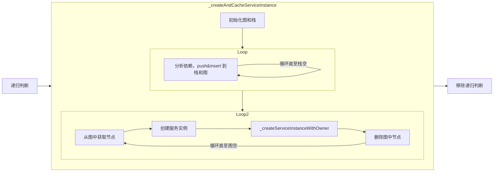

>[!note]
> It's generated by Github Copilot And Thanks [VSCode-sourcecode-analysis](https://github.com/fzxa/VSCode-sourcecode-analysis/tree/master)

# VSCode Service

在 VSCode 中，所有的功能都以服务（Service）的方式在应用中初始化和被使用。

本次 Service 学习以 `history` 作为切入点，文件路径为 `src/vs/workbench/services/history/common/history.ts`。

## 目录
- [History Service 概述](#history-service-概述)
- [目录结构](#目录结构)
- [common/history.ts](#commonhistoryts)
- [browser/historyService.ts](#browserhistoryservicets)
  - [Disposable](#disposable)
  - [构造器](#构造器)
  - [registerSingleton](#registersingleton)
- [服务初始化](#服务初始化)
  - [InstantiationService](#instantiationservice)
  - [invokeFunction](#invokefunction)
  - [_safeCreateAndCacheServiceInstance](#_safecreateandcacheserviceinstance)
  - [_createInstance](#_createinstance)
  - [延迟创建](#延迟创建)
- [Summary](#summary)

---

## History Service 概述

`history.ts` 文件定义了 VSCode 的 `IHistoryService` 接口，该接口是 VSCode 工作台（Workbench）中用于管理编辑器导航历史的核心服务之一。

### 文件作用

1. **导航历史管理**：
   - 记录用户在编辑器中打开的文件、跳转的位置（如 "转到定义" 或 "查找引用" 等操作）。
   - 提供接口以便在历史记录中进行导航，例如前进、后退、跳转到上一个位置或最后一个位置。

2. **最近使用的编辑器管理**：
   - 记录最近关闭的编辑器，支持重新打开最后关闭的编辑器。
   - 提供接口以打开最近使用的编辑器或文件。

3. **历史记录清理**：
   - 提供清理功能，允许清除所有历史记录或最近打开的编辑器列表。

4. **工作区和文件管理**：
   - 提供接口以获取最后访问的工作区根目录或文件资源，帮助用户快速定位最近使用的文件或工作区。

---

## 目录结构

在 `src/vs/workbench/services` 目录下存放了 VSCode 工作台服务中功能相关的各种服务。

### 子目录说明

- **`accessibility/`**：与无障碍功能相关的服务，例如屏幕阅读器支持。
- **`editor/`**：管理编辑器的核心功能，包括打开、关闭、布局和状态管理。
- **`history/`**：负责导航历史的管理，例如前进、后退、重新打开最近关闭的文件等。
- **`keybinding/`**：处理键绑定的解析和管理，支持用户自定义快捷键。
- **`files/`**：与文件操作相关的服务，例如文件的打开、保存、删除等。
- **`extensionManagement/`**：管理 VSCode 扩展的安装、更新和卸载。
- **`language/`**：与语言支持相关的服务，例如语法高亮、代码补全等。
- **`layout/`**：负责工作台布局的管理，例如面板、侧边栏的显示和隐藏。
- **`localization/`**：处理 VSCode 的本地化功能，支持多语言界面。

### history 相关目录结构

```shell
.
├── browser
│   └── historyService.ts
├── common
│   └── history.ts
└── test
    └── browser
        └── historyService.test.ts

5 directories, 3 files
```

---

## common/history.ts

### 起手式

```ts
export const IHistoryService = createDecorator<IHistoryService>('historyService');
export interface IHistoryService {
    ...
}
```

- **定义接口**：`IHistoryService` 描述了导航历史服务需要支持的方法，例如 `goBack`、`goForward` 等。
- **装饰器**：通过 `createDecorator` 方法获取装饰器，为其他服务模块提供 IOC 的方法。

### 跳转到实现类

借助 VSCode 的 `Go to Implements` 功能，可以快速跳转到实现类。

---

## browser/historyService.ts

### 实现类

```ts
export class HistoryService extends Disposable implements IHistoryService {}
```

- **继承 Disposable**：`HistoryService` 继承了 `Disposable`，以支持在特定阶段移除副作用。

---

### Disposable

在 VSCode 中，所有的类都需要继承 `Disposable` 抽象类，以支持统一的资源清理。

#### 示例代码

```ts
this._register(this.editorService.onDidActiveEditorChange(() => this.onDidActiveEditorChange()));
```

- **事件监听**：通过 `_register` 方法将注销函数存入 `DisposableStore`。
- **统一销毁**：调用 `dispose` 方法时，统一清理所有注册的副作用。

---

### 构造器

通过装饰器注解将当前服务需要依赖的其他服务注入。

#### 示例代码

```ts
constructor(
    @IEditorService private readonly editorService: EditorServiceImpl,
    @IEditorGroupsService private readonly editorGroupService: IEditorGroupsService,
    @IWorkspaceContextService private readonly contextService: IWorkspaceContextService,
    @IStorageService private readonly storageService: IStorageService,
    @IConfigurationService private readonly configurationService: IConfigurationService,
    @IFileService private readonly fileService: IFileService,
    @IWorkspacesService private readonly workspacesService: IWorkspacesService,
    @IInstantiationService private readonly instantiationService: IInstantiationService,
    @IWorkbenchLayoutService private readonly layoutService: IWorkbenchLayoutService,
    @IContextKeyService private readonly contextKeyService: IContextKeyService,
    @ILogService private readonly logService: ILogService
){}
```

---

### registerSingleton

定义 `HistoryService` 后，需要通过 `registerSingleton` 函数将服务注册。

#### 示例代码

```ts
registerSingleton(IHistoryService, HistoryService, InstantiationType.Eager);
```

#### 函数解析

```ts
export function registerSingleton<T, Services extends BrandedService[]>(id: ServiceIdentifier<T>, ctor: new (...services: Services) => T, supportsDelayedInstantiation: InstantiationType): void {
    ...
    _registry.push([id, ctorOrDescriptor]);
}
```

- **作用**：将服务注册到 `_registry` 中。
- **支持延迟初始化**：`supportsDelayedInstantiation` 控制服务初始化时间：
  - `Eager`：立即实例化。
  - `Delayed`：延迟到实际使用时再实例化。

---

## 服务初始化

### InstantiationService

#### 流程概览


#### 示例代码

```ts
const serviceCollection = new ServiceCollection();
for (const [id, descriptor] of getSingletonServiceDescriptors()) {
    serviceCollection.set(id, descriptor);
}
```

- **初始化**：将单例服务存入 `ServiceCollection`。
- **实例化**：将 `ServiceCollection` 作为参数传入 `InstantiationService`。

---

### invokeFunction

通过 `invokeFunction` 消费服务。

#### 示例代码

```ts
instantiationService.invokeFunction((accessor) => accessor.get(serviceId));
```

#### 实现逻辑

```ts
const accessor: ServicesAccessor = {
    get: <T>(id: ServiceIdentifier<T>) => {
        ...
        const result = this._getOrCreateServiceInstance(id, _trace);
        ...
        return result;
    }
};
```

---

### _safeCreateAndCacheServiceInstance

#### 流程概览



---

### _createInstance

#### 示例代码

```ts
private _createInstance<T>(ctor: any, args: any[] = [], _trace: Trace): T {
    ...
    return Reflect.construct<any, T>(ctor, args.concat(serviceArgs));
}
```

- **作用**：通过 `Reflect.construct` 动态创建服务实例。

---

### 延迟创建

通过 `Proxy` 实现延迟创建，拦截对服务的访问。

#### 流程概览


- **earlyListeners**：存储早期事件监听器，服务实例化后再绑定。
- **GlobalIdleValue**：判断浏览器是否空闲，空闲时执行初始化逻辑。

---

## Summary

通过本篇分析，我们可以清晰地看到 VSCode 服务的实现和初始化流程：

1. **服务定义**：通过 `createDecorator` 定义服务接口，描述服务功能。
2. **服务实现**：实现类继承 `Disposable`，支持资源清理。
3. **服务注册**：通过 `registerSingleton` 注册服务，支持延迟初始化。
4. **服务初始化**：借助 `InstantiationService` 管理服务实例化，支持依赖注入和延迟加载。
5. **延迟创建**：通过 `Proxy` 和 `GlobalIdleValue` 实现延迟加载，优化性能。

这种模块化设计使得 VSCode 的服务体系具有高度的可扩展性和灵活性，同时确保了性能和资源管理的高效性。
