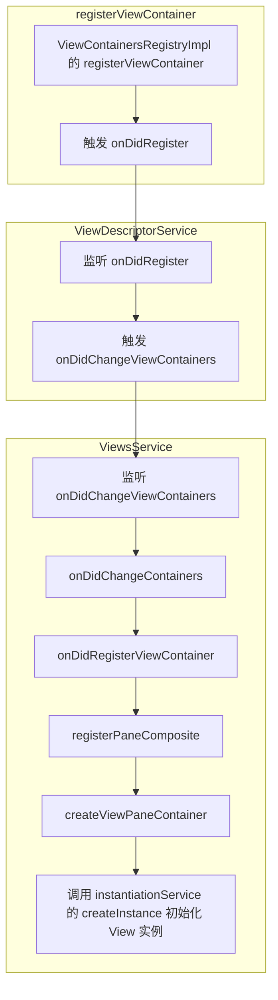

>[!note]
> It's generated by Github Copilot.


# VSCode Container & View

本文以 Auxiliary Bar 为例，详细说明 VSCode 中 Container 和 View 的作用及其使用方式。

## 目录
1. [View Container](#view-container)
   - [注册流程](#注册流程)
   - [示例](#示例)
2. [View Descriptor](#view-descriptor)
   - [注册流程](#注册流程-1)
   - [示例](#示例-1)
3. [总结](#总结)

## View Container

在 VSCode 中，Sidebar、Panel 和 AuxiliaryBar 被统称为 View Container。

```typescript
export const enum ViewContainerLocation {
	Sidebar,
	Panel,
	AuxiliaryBar
}
```

VSCode 提供了 `ViewContainerRegistry` 类，用于对 View Container 进行注册、注销和获取等操作。


### 注册流程

以下是 `ViewContainer` 的注册流程：

1. 调用 `ViewContainersRegistryImpl` 的 `registerViewContainer` 方法进行注册。
2. 注册完成后触发 `onDidRegister` 事件。
3. 在 `ViewDescriptorService` 类中监听 `onDidRegister` 事件，并触发 `onDidChangeViewContainers` 事件。
4. 在 `ViewsService` 类中监听 `onDidChangeViewContainers` 事件，调用 `onDidChangeContainers` 方法。
5. 在 `onDidChangeContainers` 方法中，调用 `registerPaneComposite` 方法，最终通过 `createViewPaneContainer` 方法创建视图容器实例。

以下是流程图：


相关代码如下：
```typescript
class ViewContainersRegistryImpl extends Disposable implements IViewContainersRegistry {
    ...
    registerViewContainer(...): ViewContainer {
        ...
		const viewContainers = getOrSet(this.viewContainers, viewContainerLocation, []);
		viewContainers.push(viewContainer);
        ...
        this._onDidRegister.fire({ viewContainer, viewContainerLocation });
        ...
	}
}

export class ViewDescriptorService extends Disposable implements IViewDescriptorService {
    ...
    constructor(){
        this._register(this.viewContainersRegistry.onDidRegister(({ viewContainer }) => {
            this.onDidRegisterViewContainer(viewContainer);
            this._onDidChangeViewContainers.fire(...);
        }));
    }
}

export class ViewsService extends Disposable implements IViewsService {
    constructor(...){
        ...
        this._register(
            this.viewDescriptorService.onDidChangeViewContainers(({ added, removed }) => this.onDidChangeContainers(added, removed))
        );
        ...
    }
}

export class ViewsService extends Disposable implements IViewsService {
    ...
    private onDidChangeContainers(added: ReadonlyArray<{ container: ViewContainer; location: ViewContainerLocation }>, ...): void {
        ...
		for (const { container, location } of added) {
			this.onDidRegisterViewContainer(container, location);
		}
	}
    private onDidRegisterViewContainer(viewContainer: ViewContainer, viewContainerLocation: ViewContainerLocation): void {
		this.registerPaneComposite(viewContainer, viewContainerLocation);
        ...
	}
    private registerPaneComposite(viewContainer: ViewContainer, viewContainerLocation: ViewContainerLocation): void {
		const that = this;
		class PaneContainer extends PaneComposite {
            ...
			protected createViewPaneContainer(element: HTMLElement): ViewPaneContainer {
				// Use composite's instantiation service to get the editor progress service for any editors instantiated within the composite
				const viewPaneContainer = that.createViewPaneContainer(element, viewContainer, viewContainerLocation, viewPaneContainerDisposables, this.instantiationService);
                ...
			}
		}
        ...
	}
    private createViewPaneContainer(...): ViewPaneContainer {
		const viewPaneContainer: ViewPaneContainer = (instantiationService as any).createInstance(viewContainer.ctorDescriptor.ctor, ...(viewContainer.ctorDescriptor.staticArguments || []));

		this.viewPaneContainers.set(viewPaneContainer.getId(), viewPaneContainer);
        ...
		return viewPaneContainer;
	}
}
```

### 示例

以下是一个注册 View Container 的示例：

```typescript
const chatViewContainer: ViewContainer = Registry.as<IViewContainersRegistry>(ViewExtensions.ViewContainersRegistry).registerViewContainer({
	id: CHAT_SIDEBAR_PANEL_ID,
	title: localize2('chat.viewContainer.label', "Chat"),
	icon: Codicon.commentDiscussion,
	ctorDescriptor: new SyncDescriptor(ViewPaneContainer, [CHAT_SIDEBAR_PANEL_ID, { mergeViewWithContainerWhenSingleView: true }]),
	storageId: CHAT_SIDEBAR_PANEL_ID,
	hideIfEmpty: true,
	order: 100,
}, ViewContainerLocation.AuxiliaryBar, { isDefault: true, doNotRegisterOpenCommand: true });
```

参数说明：
- **id**: ViewContainer 的唯一标识符。
- **title**: ViewContainer 的标题，显示在 AuxiliaryBar 或 Sidebar 中。
- **icon**: ViewContainer 的图标。
- **ctorDescriptor**: 构造函数描述符，用于实例化视图容器。
- **storageId**: 存储 ViewContainer 的状态（如布局数据、折叠/展开状态）。
- **hideIfEmpty**: 是否在没有 View 时隐藏。
- **order**: 排序，数字越小越靠前。

## View Descriptor

一个 View Container 可以包含多个 View，而这些 View 是通过 `ViewsRegistry` 的 `registerViews` 方法注册的。

```typescript
export interface IViewsRegistry {
    ...
	registerViews(views: IViewDescriptor[], viewContainer: ViewContainer): void;
    ...
}
```

### 注册流程

1. 调用 `ViewsRegistry` 的 `registerViews` 方法，将 `IViewDescriptor` 数组注册到指定的 View Container。
2. 注册完成后触发 `onViewsRegistered` 事件。
3. 在 `ViewDescriptorService` 类中监听 `onViewsRegistered` 事件，调用 `onDidRegisterViews` 方法。
4. 在 `onDidRegisterViews` 方法中，调用 `addViews` 方法，将 View 添加到 View Container 中。
5. 在 `ViewPaneContainer` 中监听 `onDidAddVisibleViewDescriptors` 事件，调用 `onDidAddViewDescriptors` 方法，通过 `createView` 方法创建 View 实例。

相关代码如下：
```typescript
class ViewsRegistry extends Disposable implements IViewsRegistry {
    ...
	registerViews(views: IViewDescriptor[], viewContainer: ViewContainer): void {
		this.registerViews2([{ views, viewContainer }]);
	}
	registerViews2(views: { views: IViewDescriptor[]; viewContainer: ViewContainer }[]): void {
		views.forEach(({ views, viewContainer }) => this.addViews(views, viewContainer));
		this._onViewsRegistered.fire(views);
	}
    ...
}

export class ViewDescriptorService extends Disposable implements IViewDescriptorService {
    ...
    constructor(...){
        ...
        this.viewContainersRegistry = Registry.as<IViewContainersRegistry>(ViewExtensions.ViewContainersRegistry);
		this.viewsRegistry = Registry.as<IViewsRegistry>(ViewExtensions.ViewsRegistry);
        ...
        this._register(this.viewsRegistry.onViewsRegistered(views => this.onDidRegisterViews(views)));
        ...
    }
    ...
    private onDidRegisterViews(views: { views: IViewDescriptor[]; viewContainer: ViewContainer }[]): void {
		this.contextKeyService.bufferChangeEvents(() => {
			views.forEach(({ views, viewContainer }) => {
                ...
				// Once they are grouped, try registering them which occurs
				// if the container has already been registered within this service
				// or we can generate the container from the source view id
				this.registerGroupedViews(regroupedViews);
                ...
			});
		});
	}
    private registerGroupedViews(groupedViews: Map<string, IViewDescriptor[]>): void {
		for (const [containerId, views] of groupedViews.entries()) {
			...
			this.addViews(viewContainer, viewsToAdd);
		}
	}
    private addViews(...): void {
        ...
		this.getViewContainerModel(container).add(...);
	}
}

export class ViewContainerModel extends Disposable implements IViewContainerModel {
    ...
    add(addedViewDescriptorStates: IAddedViewDescriptorState[]): void {
		...
		this.broadCastAddedVisibleViewDescriptors(addedVisibleDescriptors);
	}
    private broadCastAddedVisibleViewDescriptors(added: IAddedViewDescriptorRef[]): void {
		if (added.length) {
			this._onDidAddVisibleViewDescriptors.fire(added.sort((a, b) => a.index - b.index));
            ...
		}
	}
}

export class ViewPaneContainer extends Component implements IViewPaneContainer {
    ...
    create(parent: HTMLElement): void {
        ...
        this._register(this.viewContainerModel.onDidAddVisibleViewDescriptors(added => this.onDidAddViewDescriptors(added)));
        ...
    }
    ...
    protected onDidAddViewDescriptors(added: IAddedViewDescriptorRef[]): ViewPane[] {
		const panesToAdd: { pane: ViewPane; size: number; index: number; disposable: IDisposable }[] = [];

		for (const { viewDescriptor, collapsed, index, size } of added) {
			const pane = this.createView(viewDescriptor,
				{
					id: viewDescriptor.id,
					title: viewDescriptor.name.value,
					fromExtensionId: (viewDescriptor as Partial<ICustomViewDescriptor>).extensionId,
					expanded: !collapsed,
					singleViewPaneContainerTitle: viewDescriptor.singleViewPaneContainerTitle,
				});

			try {
				pane.render();
			} catch (error) {
				this.logService.error(`Fail to render view ${viewDescriptor.id}`, error);
				continue;
			}
            ...
		}
        ...
	}
    ...
    protected createView(viewDescriptor: IViewDescriptor, options: IViewletViewOptions): ViewPane {
		return (this.instantiationService as any).createInstance(viewDescriptor.ctorDescriptor.ctor, ...(viewDescriptor.ctorDescriptor.staticArguments || []), options) as ViewPane;
	}
}
```

### 示例

以下是一个 View Descriptor 的示例：

```typescript
{
	id: ChatViewId,
	containerIcon: chatViewContainer.icon,
	containerTitle: chatViewContainer.title.value,
	singleViewPaneContainerTitle: chatViewContainer.title.value,
	name: localize2('chat.viewContainer.label', "Chat"),
	canToggleVisibility: false,
	canMoveView: true,
	openCommandActionDescriptor: ...
	ctorDescriptor: new SyncDescriptor(ChatViewPane, [{ location: ChatAgentLocation.Panel }]),
	when: ...
}
```

参数说明：
- **id**: View 的唯一标识符。
- **containerIcon**: ViewContainer 的图标。
- **containerTitle**: ViewContainer 的标题。
- **singleViewPaneContainerTitle**: 当容器中只有一个视图时的标题。
- **name**: View 的名称，显示在视图的标题栏。
- **canToggleVisibility**: 是否可以切换可见性。
- **canMoveView**: 是否可以移动。
- **openCommandActionDescriptor**: 打开命令的描述符。
- **ctorDescriptor**: 构造函数描述符，用于实例化视图。
- **when**: 条件描述符，用于控制 View 的显示和隐藏。

### View 实例化

`ctorDescriptor` 的构造函数需要继承 `ViewPane` 抽象类，而 `ViewPane` 实现了 `IView` 接口。

```typescript
export class ChatViewPane extends ViewPane implements IViewWelcomeDelegate {...}
export abstract class ViewPane extends Pane implements IView {...}
```

## 总结

在 VSCode 中，Chat 模块相关视图，debug 模块相关视图，outline 相关视图，search 模块相关视图等均都是通过这种方式添加。

本文详细介绍了 VSCode 中 View Container 和 View 的作用及其注册流程。通过 View Container 和 View 的模块化设计，VSCode 实现了灵活的视图管理机制，便于扩展和维护。了解这些机制有助于开发者更高效地开发 VSCode 插件和扩展功能。

