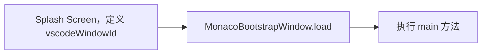
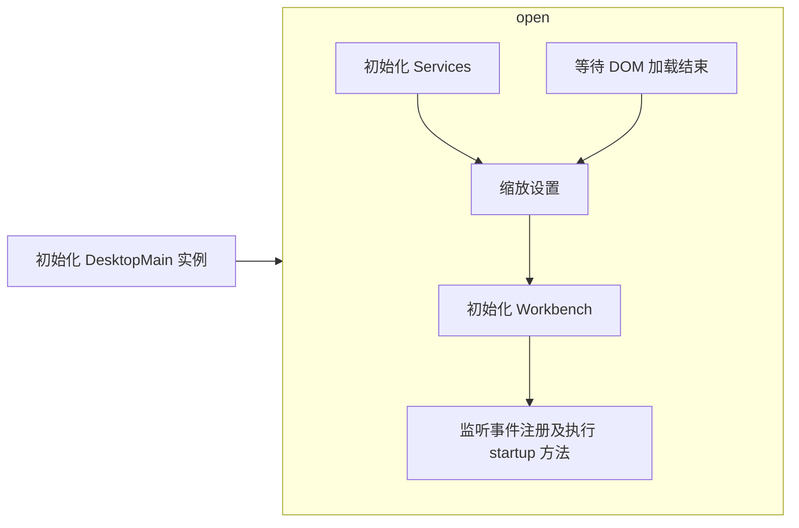

>[!note]
> It's generated by Github Copilot And Thanks [VSCode-sourcecode-analysis](https://github.com/fzxa/VSCode-sourcecode-analysis/tree/master)

# VSCode Workbench

承接[上一篇](./[Copilot]VSCode-sourcecode.md)的最后为切入点，本篇以 `statusBar` 为例，学习 VSCode Workbench 实现的逻辑。

## 目录
- [HTML 文件加载](#html-文件加载)
- [渲染进程启动](#渲染进程启动)
  - [MonacoBootstrapWindow 挂载](#monacobootstrapwindow-挂载)
- [DesktopMain 初始化](#desktopmain-初始化)
  - [open 方法](#open-方法)
- [Workbench 初始化](#workbench-初始化)
  - [initLayout](#initlayout)
  - [renderWorkbench](#renderworkbench)
  - [createWorkbenchLayout](#createworkbenchlayout)
- [Summary](#summary)

---

## HTML 文件加载

### 文件路径

`code/electron-sandbox/workbench/workbench.html` 是 VSCode 的入口 HTML 文件，负责加载主样式和主脚本。

### 文件内容

```html
<html>
	<head>
		...
		<!-- Workbench CSS -->
		<link rel="stylesheet" href="../../../workbench/workbench.desktop.main.css">
	</head>

	<body aria-label="">
	</body>

	<!-- Startup (do not modify order of script tags!) -->
	<script src="./workbench.js" type="module"></script>
</html>
```

### 构建来源

<details>
<summary>Github Copilot</summary>

> `workbench.desktop.main.css` 和 `workbench.js` 是由多个源文件通过构建工具（如 Webpack 或类似工具）打包生成的。以下是它们的主要来源文件：
> 
> ### 1. **`workbench.desktop.main.css`**
>    - **来源文件**：
>      - 位于 media 和 contrib 目录下的多个 `.css` 文件。
>      - 例如：
>        - style.css
>        - media
>        - `/workspaces/vscode/src/vs/workbench/contrib/*/media/*.css`
>      - 这些文件通过构建工具合并并优化为 `workbench.desktop.main.css`。
> 
> ### 2. **`workbench.js`**
>    - **来源文件**：
>      - 位于 workbench 目录下的多个 `.ts` 文件。
>      - 例如：
>        - workbench.common.main.ts
>        - workbench.desktop.main.ts
>        - browser 和 contrib 下的 `.ts` 文件。
>      - 这些文件通过构建工具（如 Webpack 或 esbuild）打包为单个 `workbench.js` 文件。
> 
> ### **构建过程**
>    - **CSS 文件**：
>      - 使用工具（如 `gulp` 或 `postcss`）将多个 `.css` 文件合并、压缩，并生成 `workbench.desktop.main.css`。
>    - **JS 文件**：
>      - 使用工具（如 `Webpack` 或 `esbuild`）将多个 `.ts` 文件编译为 `.js`，并打包为单个 `workbench.js` 文件。
> 
> 如果需要定位具体的功能或样式来源，可以从 `workbench.desktop.main.css` 或 `workbench.js` 中的内容入手，搜索对应的类名、变量名或模块名，回溯到源文件。

</details>

---

## 渲染进程启动

### 渲染流程概览



### MonacoBootstrapWindow 挂载

`window.MonacoBootstrapWindow` 是通过 `src/bootstrap-window.ts` 中的 `load` 方法加载 `vs/workbench/workbench.desktop.main` 模块。

#### 挂载时机

<details>
<summary>Github Copilot</summary>

> `bootstrap-window.ts` 是在 Electron 渲染进程启动时通过预加载脚本加载的。具体来说，它是在 Electron 的 `preload` 阶段被加载并定义的。以下是它的加载过程和时机：
> 
> ### 1. **加载时机**
>    - `bootstrap-window.ts` 是通过 Electron 的 `preload` 脚本机制加载的。
>    - Electron 的 `preload` 脚本会在渲染进程加载 HTML 文件（如 `workbench.html`）之前运行。
>    - 在 `preload` 脚本中，`bootstrap-window.ts` 定义了 `MonacoBootstrapWindow`，并将其挂载到 `window` 对象上。
> 
> ### 2. **加载代码**
>    - 相关代码可以在 Electron 的 `preload.ts` 文件中找到：
>      ```typescript
>      // filepath: /workspaces/vscode/src/vs/code/electron-sandbox/preload.ts
>      import { bootstrapWindow } from './bootstrap-window';
> 
>      // Expose MonacoBootstrapWindow to the global scope
>      (window as any).MonacoBootstrapWindow = bootstrapWindow;
>      ```
>    - 这里将 `bootstrapWindow` 从 `bootstrap-window.ts` 导入，并挂载到 `window.MonacoBootstrapWindow`。
> 
> ### 3. **`bootstrap-window.ts` 的作用**
>    - 文件路径: `/workspaces/vscode/src/vs/code/electron-sandbox/bootstrap-window.ts`
>    - 该文件定义了 `bootstrapWindow`，用于初始化和加载工作台（Workbench）的核心逻辑。
>    - 它负责加载模块、处理配置，并提供与主进程的通信接口。
> 
> ### 4. **加载过程总结**
>    - Electron 主进程启动时，会为每个窗口指定一个 `preload` 脚本。
>    - 在 `preload` 脚本中，`bootstrap-window.ts` 被加载并定义了 `MonacoBootstrapWindow`。
>    - 当 workbench.ts 中需要使用 `MonacoBootstrapWindow` 时，它已经通过 `preload` 脚本挂载到 `window` 对象上。
> 
> 如果你需要进一步确认，可以查看 Electron 主进程的窗口创建代码，通常在 `main.js` 或类似文件中会指定 `preload` 脚本的路径。

</details>

---

## DesktopMain 初始化

### open 方法

`open` 方法位于 `DesktopMain` 类中，是 VSCode 桌面主进程的核心方法之一。

#### 流程概览



#### 功能分析

<details>
<summary>Github Copilot</summary>

> # `open` 方法的作用
> 
> `open` 方法位于 `DesktopMain` 类中，是 VS Code 桌面主进程的核心方法之一，负责初始化服务、创建工作台（Workbench），并启动整个窗口的用户界面。它是 VS Code 启动流程中从主进程到渲染进程的关键桥梁。
> 
> ## 主要功能
> 
> 1. **初始化服务**：
>    - 调用 `initServices` 方法，初始化所有需要的服务（如日志服务、文件服务、配置服务等）。
>    - 这些服务会被注入到工作台中，供后续使用。
> 
> 2. **等待 DOM 准备**：
>    - 使用 `domContentLoaded` 确保主窗口的 DOM 已经加载完成，避免在未准备好时操作 DOM。
> 
> 3. **应用缩放级别**：
>    - 调用 `applyWindowZoomLevel` 方法，根据用户配置或窗口自定义设置调整缩放级别，避免界面闪烁。
> 
> 4. **创建工作台**：
>    - 实例化 `Workbench` 类，传入主窗口的 DOM 元素、服务集合和日志服务。
>    - 工作台是 VS Code 的核心 UI 容器，负责渲染编辑器、侧边栏、状态栏等。
> 
> 5. **注册事件监听器**：
>    - 调用 `registerListeners` 方法，为工作台和存储服务注册生命周期事件（如关闭、销毁等）。
> 
> 6. **启动工作台**：
>    - 调用 `workbench.startup()` 方法，启动工作台的核心逻辑。
>    - 创建并注册 `NativeWindow` 实例，完成窗口的初始化。
> 
> ## 执行流程
> 
> 1. **并行初始化服务和等待 DOM 准备**：
>    ```typescript
>    const [services] = await Promise.all([this.initServices(), domContentLoaded(mainWindow)]);
>    ```
> 
> 2. **应用缩放级别**：
>    ```typescript
>    this.applyWindowZoomLevel(services.configurationService);
>    ```
> 
> 3. **创建工作台**：
>    ```typescript
>    const workbench = new Workbench(mainWindow.document.body, { extraClasses: this.getExtraClasses() }, services.serviceCollection, services.logService);
>    ```
> 
> 4. **注册监听器**：
>    ```typescript
>    this.registerListeners(workbench, services.storageService);
>    ```
> 
> 5. **启动工作台并注册窗口**：
>    ```typescript
>    const instantiationService = workbench.startup();
>    this._register(instantiationService.createInstance(NativeWindow));
>    ```
> 
> ## 作用总结
> 
> `open` 方法是 VS Code 桌面应用启动的核心逻辑之一，负责从服务初始化到 UI 渲染的整个流程。它确保所有依赖的服务和配置都已准备好，并将工作台作为主界面加载到窗口中，为用户提供完整的编辑体验。

</details>

---

## Workbench 初始化

`Workbench` 是 VSCode 的核心 UI 容器，负责渲染编辑器、侧边栏、状态栏等。

部分代码如下：

```ts
export class Workbench extends Layout {
	constructor(...) {
		super(parent);
		...
	}
	startup(): IInstantiationService {
		...
		// Layout
		this.initLayout(accessor);
		...
		// Render Workbench
		this.renderWorkbench(instantiationService, notificationService, storageService, configurationService);

		// Workbench Layout
		this.createWorkbenchLayout();
		...
	}
}
```


<details>
<summary>Github Copilot</summary>

> # `startup` 方法的作用
> 
> `startup` 方法位于 `Workbench` 类中，是 VS Code 工作台（Workbench）初始化和启动的核心方法。它负责配置、布局、渲染和恢复工作台的状态，是整个编辑器用户界面加载的关键步骤。
> 
> ## 主要功能
> 
> 1. **配置事件泄漏阈值**：
>    - 调用 `setGlobalLeakWarningThreshold` 设置事件发射器的泄漏警告阈值，避免过多事件监听器导致性能问题。
> 
> 2. **初始化服务**：
>    - 调用 `initServices` 方法，初始化所有需要的服务（如生命周期服务、存储服务、配置服务等）。
>    - 这些服务被注入到工作台中，供后续使用。
> 
> 3. **注册工作台组件**：
>    - 注册工作台的核心组件和功能，包括布局、编辑器工厂、上下文键处理器等。
> 
> 4. **注册事件监听器**：
>    - 为生命周期、存储、配置、主机服务等注册事件监听器，处理窗口关闭、配置更改等事件。
> 
> 5. **渲染工作台**：
>    - 调用 `renderWorkbench` 方法，渲染工作台的 DOM 结构，包括标题栏、活动栏、侧边栏、编辑器、状态栏等。
> 
> 6. **创建布局**：
>    - 调用 `createWorkbenchLayout` 方法，初始化工作台的布局管理器，负责窗口的布局和调整。
> 
> 7. **恢复状态**：
>    - 调用 `restore` 方法，恢复工作台的状态，包括编辑器、视图和布局的状态。
> 
> 8. **返回实例化服务**：
>    - 返回 `IInstantiationService`，供其他组件使用。
> 
> ## 执行流程
> 
> 1. **初始化服务**：
>    ```typescript
>    const instantiationService = this.initServices(this.serviceCollection);
>    ```
> 
> 2. **注册组件和监听器**：
>    ```typescript
>    instantiationService.invokeFunction(accessor => {
>        const lifecycleService = accessor.get(ILifecycleService);
>        const storageService = accessor.get(IStorageService);
>        const configurationService = accessor.get(IConfigurationService);
>        const hostService = accessor.get(IHostService);
>        const hoverService = accessor.get(IHoverService);
>        const dialogService = accessor.get(IDialogService);
>        const notificationService = accessor.get(INotificationService) as NotificationService;
> 
>        // 注册布局、上下文键、监听器等
>        this.initLayout(accessor);
>        this.registerListeners(lifecycleService, storageService, configurationService, hostService, dialogService);
>    });
>    ```
> 
> 3. **渲染和布局**：
>    ```typescript
>    this.renderWorkbench(instantiationService, notificationService, storageService, configurationService);
>    this.createWorkbenchLayout();
>    this.layout();
>    ```
> 
> 4. **恢复状态**：
>    ```typescript
>    this.restore(lifecycleService);
>    ```
> 
> 5. **返回实例化服务**：
>    ```typescript
>    return instantiationService;
>    ```
> 
> ## 作用总结
> 
> `startup` 方法是 VS Code 工作台启动的核心逻辑，负责从服务初始化到界面渲染的整个流程。它确保所有依赖的服务和组件都已准备好，并将工作台完整地加载到用户界面中，为用户提供完整的编辑体验。

</details>


### initLayout

`initLayout` 方法负责注册布局、上下文键、监听器等。

#### 代码片段

```typescript
protected initLayout(accessor: ServicesAccessor): void {
	// Services
	...
	// Parts
	this.editorService = accessor.get(IEditorService);
	this.mainPartEditorService = this.editorService.createScoped('main', this._store);
	this.editorGroupService = accessor.get(IEditorGroupsService);
	this.paneCompositeService = accessor.get(IPaneCompositePartService);
	this.viewDescriptorService = accessor.get(IViewDescriptorService);
	this.titleService = accessor.get(ITitleService);
	this.notificationService = accessor.get(INotificationService);
	this.statusBarService = accessor.get(IStatusbarService);
	accessor.get(IBannerService);

	// Listeners
	...
	// State
	this.initLayoutState(accessor.get(ILifecycleService), accessor.get(IFileService));
}
```

#### 功能分析

- **布局注册**：在此方法中注册 `StatusBar` 等布局。
- **状态初始化**：通过 `initLayoutState` 设置 `StatusBar` 是否隐藏、`Panel` 的位置信息等。

---

### renderWorkbench

`renderWorkbench` 方法负责渲染工作台的 DOM 结构。

#### 功能分析

<details>
<summary>Github Copilot</summary>

> # `renderWorkbench` 方法的作用
> 
> `renderWorkbench` 方法位于 `Workbench` 类中，是 VS Code 工作台（Workbench）渲染的核心方法。它负责将工作台的 DOM 结构和相关组件渲染到主窗口中，为用户提供完整的编辑器界面。
> 
> ## 主要功能
> 
> 1. **设置 ARIA 容器和无障碍信号调度器**：
>    - 调用 `setARIAContainer` 设置 ARIA 容器，用于无障碍功能支持。
>    - 调用 `setProgressAcccessibilitySignalScheduler` 设置无障碍进度信号调度器，支持屏幕阅读器的无障碍访问。
> 
> 2. **添加平台和状态相关的 CSS 类**：
>    - 根据操作系统（Windows、Linux、macOS）和浏览器类型（Chrome、Firefox、Safari）动态添加 CSS 类。
>    - 添加布局相关的类（如侧边栏位置、额外的自定义类等）。
> 
> 3. **应用字体抗锯齿设置**：
>    - 调用 `updateFontAliasing` 方法，根据用户配置应用字体抗锯齿设置（仅适用于 macOS）。
> 
> 4. **恢复字体缓存信息**：
>    - 调用 `restoreFontInfo` 方法，恢复字体测量信息以优化字体渲染。
> 
> 5. **创建工作台的各个部分（Parts）**：
>    - 创建并初始化工作台的核心部分，包括标题栏、活动栏、侧边栏、编辑器、状态栏等。
>    - 每个部分通过 `createPart` 方法生成对应的 DOM 元素，并调用其 `create` 方法完成初始化。
> 
> 6. **创建通知处理器**：
>    - 调用 `createNotificationsHandlers` 方法，初始化通知中心、通知弹窗、通知状态等组件，并注册相关事件。
> 
> 7. **将工作台添加到 DOM 中**：
>    - 将工作台的主容器（`mainContainer`）添加到父容器中，完成渲染。
> 
> ## 执行流程
> 
> 1. **设置无障碍支持**：
>    ```typescript
>    setARIAContainer(this.mainContainer);
>    setProgressAcccessibilitySignalScheduler((msDelayTime: number, msLoopTime?: number) => instantiationService.createInstance(AccessibilityProgressSignalScheduler, msDelayTime, msLoopTime));
>    ```
> 
> 2. **动态添加 CSS 类**：
>    ```typescript
>    const platformClass = isWindows ? 'windows' : isLinux ? 'linux' : 'mac';
>    const workbenchClasses = coalesce([
>        'monaco-workbench',
>        platformClass,
>        isWeb ? 'web' : undefined,
>        isChrome ? 'chromium' : isFirefox ? 'firefox' : isSafari ? 'safari' : undefined,
>        ...this.getLayoutClasses(),
>        ...(this.options?.extraClasses ? this.options.extraClasses : [])
>    ]);
>    this.mainContainer.classList.add(...workbenchClasses);
>    ```
> 
> 3. **恢复字体信息**：
>    ```typescript
>    this.restoreFontInfo(storageService, configurationService);
>    ```
> 
> 4. **创建工作台的各个部分**：
>    ```typescript
>    for (const { id, role, classes, options } of [
>        { id: Parts.TITLEBAR_PART, role: 'none', classes: ['titlebar'] },
>        { id: Parts.BANNER_PART, role: 'banner', classes: ['banner'] },
>        { id: Parts.ACTIVITYBAR_PART, role: 'none', classes: ['activitybar', this.getSideBarPosition() === Position.LEFT ? 'left' : 'right'] },
>        { id: Parts.SIDEBAR_PART, role: 'none', classes: ['sidebar', this.getSideBarPosition() === Position.LEFT ? 'left' : 'right'] },
>        { id: Parts.EDITOR_PART, role: 'main', classes: ['editor'], options: { restorePreviousState: this.willRestoreEditors() } },
>        { id: Parts.PANEL_PART, role: 'none', classes: ['panel', 'basepanel', positionToString(this.getPanelPosition())] },
>        { id: Parts.AUXILIARYBAR_PART, role: 'none', classes: ['auxiliarybar', 'basepanel', this.getSideBarPosition() === Position.LEFT ? 'right' : 'left'] },
>        { id: Parts.STATUSBAR_PART, role: 'status', classes: ['statusbar'] }
>    ]) {
>        const partContainer = this.createPart(id, role, classes);
>        this.getPart(id).create(partContainer, options);
>    }
>    ```
> 
> 5. **创建通知处理器**：
>    ```typescript
>    this.createNotificationsHandlers(instantiationService, notificationService);
>    ```
> 
> 6. **将工作台添加到 DOM**：
>    ```typescript
>    this.parent.appendChild(this.mainContainer);
>    ```
> 
> ## 作用总结
> 
> `renderWorkbench` 方法是 VS Code 工作台渲染的核心逻辑，负责将工作台的所有部分（如标题栏、编辑器、状态栏等）渲染到主窗口中，并应用平台相关的样式和无障碍支持。它确保工作台的 DOM 结构和功能组件正确初始化，为用户提供完整的编辑器界面。
> 
> Similar code found with 4 license types

</details>

---

### createWorkbenchLayout

`createWorkbenchLayout` 方法负责初始化工作台的布局管理器。

#### 代码片段

```typescript
protected createWorkbenchLayout(): void {
	...
	const viewMap = {
		[Parts.ACTIVITYBAR_PART]: this.activityBarPartView,
		[Parts.BANNER_PART]: this.bannerPartView,
		[Parts.TITLEBAR_PART]: this.titleBarPartView,
		[Parts.EDITOR_PART]: this.editorPartView,
		[Parts.PANEL_PART]: this.panelPartView,
		[Parts.SIDEBAR_PART]: this.sideBarPartView,
		[Parts.STATUSBAR_PART]: this.statusBarPartView,
		[Parts.AUXILIARYBAR_PART]: this.auxiliaryBarPartView
	};

	const fromJSON = ({ type }: { type: Parts }) => viewMap[type];
	const workbenchGrid = SerializableGrid.deserialize(
		this.createGridDescriptor(),
		{ fromJSON },
		{ proportionalLayout: false }
	);

	this.mainContainer.prepend(workbenchGrid.element);
	...
}
```

#### 功能分析

- **布局映射**：将 `Parts` 映射到对应的视图（如 `StatusBar`）。
- **布局初始化**：通过 `SerializableGrid` 初始化布局管理器。
- **DOM 渲染**：将布局网格添加到主容器中。

---

## Summary

通过本篇分析，我们可以清晰地看到 VSCode Workbench 的实现流程：

1. **HTML 文件加载**：`workbench.html` 加载主样式和脚本，提供渲染进程的入口。
2. **渲染进程启动**：通过 `MonacoBootstrapWindow` 加载核心模块，完成初始化。
3. **DesktopMain 初始化**：`open` 方法初始化服务、等待 DOM 加载、创建 Workbench。
4. **Workbench 初始化**：
   - `initLayout`：注册布局和状态。
   - `renderWorkbench`：渲染工作台的 DOM 结构。
   - `createWorkbenchLayout`：初始化布局管理器。

这种模块化设计使得 VSCode 的工作台具有高度的可扩展性和灵活性，同时确保了性能和用户体验。

