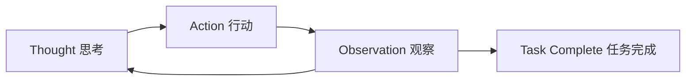
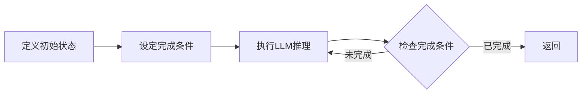
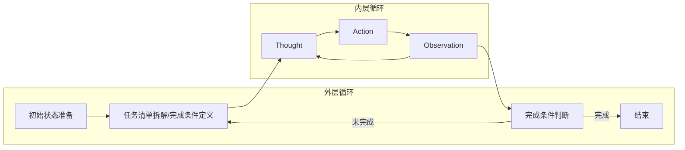

# Agent Loop 实践指南

## 前言

Agent 的核心价值在于将复杂任务自动化分解和执行，而实现这一能力的关键就是 **Loop 机制**。本文基于实际项目经验，深入分析两种主流的 Agent Loop 设计模式及其优劣。

在我的理解里，Agent 是由 QA 大模型 + 上下文 + 循环机制组成的。即：

$$Agent = LLM + Context + Loop$$

> 其中，$LLM$ 提供推理能力，$Context$ 管理任务上下文，$Loop$ 控制执行流程。

## Agent Loop 的本质

Agent Loop 本质上是一个**任务分解与执行的控制系统**。它将人类解决复杂问题的思维过程程序化：

1. **分析当前状态** - 理解现在处于什么位置
2. **制定下一步计划** - 决定接下来要做什么  
3. **执行具体行动** - 调用工具完成子任务
4. **评估执行结果** - 判断是否达到预期目标
5. **决定是否继续** - 根据结果决定下一轮循环

这个过程不断重复，直到完成整体任务目标。

## 两种主流 Loop 设计

### ReAct Loop：思考-行动循环

ReAct Loop 模拟人类的"想-做-看"思维模式，通过三个阶段的循环来解决问题。

#### 核心机制



- **Thought阶段**：Agent 分析当前情况，制定下一步策略
- **Action阶段**：Agent 执行具体操作，调用工具或API
- **Observation阶段**：Agent 观察执行结果，判断是否继续

#### 实现要点

```typescript
async function ReAct_loop(task: string) {
    const context = {
        stage: 'thought';
        ...initialize_context()
    }
    
    while (true) {
        if(context.stage === 'thought'){
            messages.push({
                role: "user",
                content: "Since you are in thought stage, please think step by step and not access to any tools."
            })
        } else if(context.stage === 'action'){
            messages.push({
                role: "user",
                content: "Since you are in action stage, please use tools based on your thought."
            })
        } else if(context.stage === 'observation'){
            messages.push({
                role: "user",
                content: "Since you are in observation stage, please observe and reflect it on the result of action."
            })
        }
        await llm.call(context);
        go_next_stage()

        // Determinate about final answer
        if(is_final_answer()){
            break;
        }
    }
}
```

#### 优势与局限

**优势**：
- 模拟人类自然思维过程，易于理解和调试
- 具备一定的自我纠错能力
- 适合处理开放性问题

**局限**：
- 依赖 LLM 判断任务完成，可能出现误判
- 在复杂长任务中容易陷入循环或提早退出
- 缺乏明确的进度控制机制

### Ralph Loop

Ralph Loop 通过无限循环直至 PRD 都完成的设计思路，借助预定义的完成条件来控制循环。

#### 核心机制



#### 优势与局限

**优势**：
明确的完成标准，避免主观判断
- 进度可控，便于监控和调试
- 适合结构化任务

**局限**：
- 需要预先定义完成条件，不够灵活
- 对于创新性任杂条件的检查可能消耗较多资源

## 混合策略：最佳实践

在实际项目中，我们发现单一的 Loop 模式往往无法很好地处理复杂业务场景。因此，我们采用混合策略，通过外层 Ralph Loop，内层 ReAct Loop 的**两层**设计：

### 架构设计


