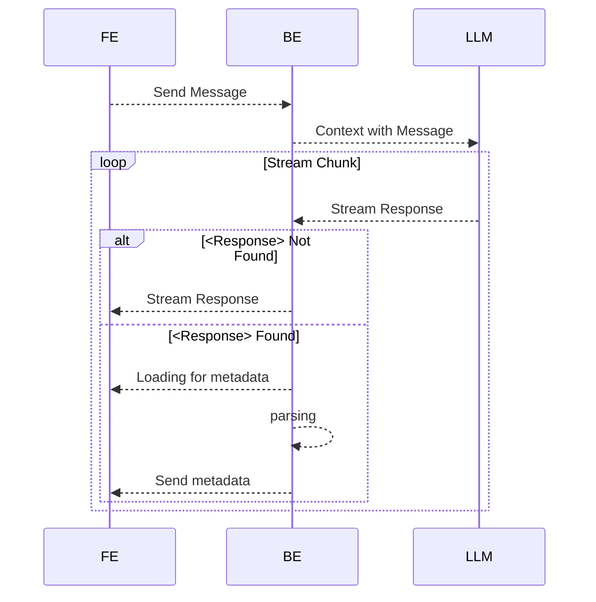
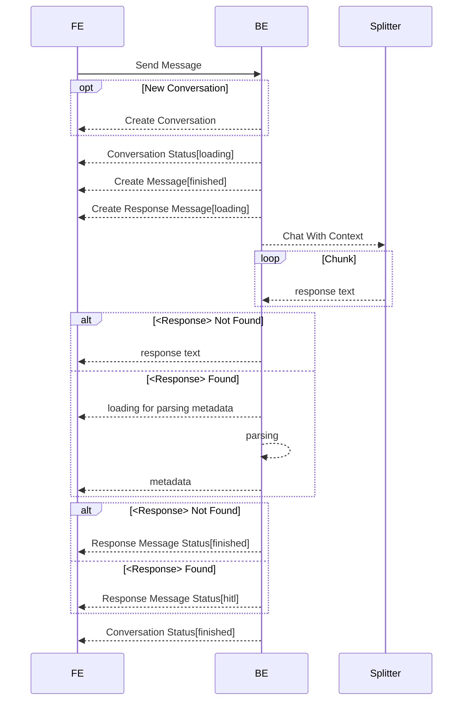
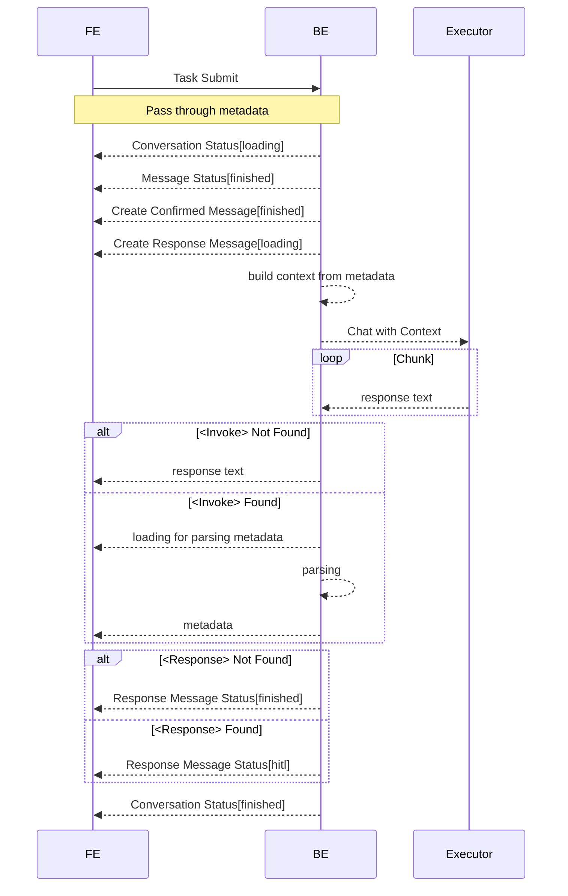
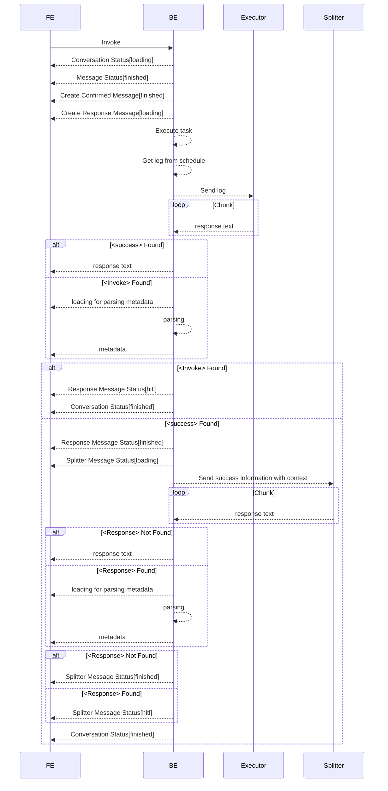
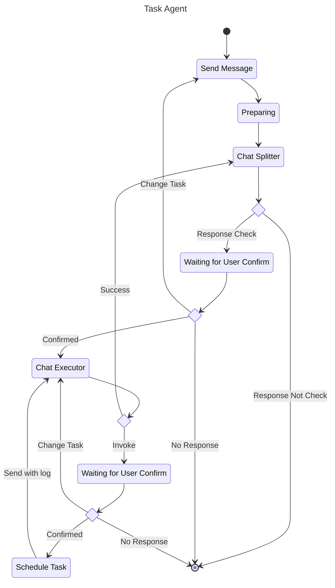

# How To Build Agent Application

## 前言

本文档介绍如何构建 Agent 应用。首先，给出 Agent 的核心定义是：

$$
\textit{Agent Application} = \textit{Application} + \textit{Agent} + \textit{MCP}
$$

> 其中，$\textit{Application}$ 表示应用的基本功能，$\textit{Agent}$ 表示智能体的能力，$\textit{MCP}$ 是 $\textit{Application}$ 和 $\textit{Agent}$ 之间的桥梁。

由上述可知，Agent 应用并非单纯的 AI 应用，其核心是围绕 Application 的基础功能，并辅以 AI 手段（如 RAG，MCP 等技术），其目的是提升 Application 的能力。

故而可知，评价 Agent 应用的好坏，最终还是要看其所依赖的 Application 的质量以及 Application 能提供给 Agent 的 MCP 的质量。

## Set up

首先，需要准备一个功能丰富且齐全的应用程序作为基础。这里以一个简单但功能齐全的任务调度系统作为例子。

### 任务调度系统

任务调度系统的核心功能包括：

- **VFS**（虚拟文件系统）：提供文件的统一管理和访问接口。
- **上下文管理**：支持任务的上下文信息管理，包括输入、输出、状态等。
- **任务管理**：支持任务的创建、调度、执行和监控。
- **权限隔离**：支持用户、项目的权限隔离。

任务调度系统的主流程如下：

- 登录并创建项目
- 在项目中创建目录及文件
- 通过临时运行任务确保任务高效运行
- 将任务提交至调度系统，并确认 cron 以及上下文
- 通过监控查看周期任务执行情况

## Agent 集成设计

在集成 Agent 之前，需要考虑以下几个方面：

1. **智能化设计**：如何提升 Agent 的智能化水平，实现更复杂的任务处理和决策能力。
2. **交互设计**：Agent 的交互应如何实现使得最大化用户体验。
3. **MCP 设计**：Application 可以为 Agent 提供怎样的 MCP 以提高 Agent 的能力。

### 智能化设计

根据[AI 应用的三大核心](./ai-app-cores.md)中提到的核心观点：

> **AI 应用的质量取决于模型质量，上下文质量和提示词质量**

因此，需要从模型质量、上下文质量和提示词质量三个方面来提升 Agent 的智能化水平。

#### 模型质量

一般来说，选择能推理，会思考的模型会更好。或者考虑用自研的模型，这里可以根据具体需求进行定制。


#### 上下文质量

通常来说，提升上下文质量需要靠 Context Engineering 来实现。

但这次，我们除了借助 Context Engineering 的方式来实现，同时也借助 Multi-Agent 的方式来提升上下文质量。

将 Agent 根据任务的职责进行区分，分为 Splitter 和 Executor（根据实际情况进行拆分，复杂的 Agent 系统可能会有更多的角色，比如：Conclusion、Reviewer 等）。

> 需要注意的是，并不是越多角色越好，根据 Claude Code 的实践经验来看，Keep it Simple and Stupid 是最好的。

#### 提示词质量

在 Multi-Agent 中，为每一个 Agent 提供高质量的提示词是至关重要的。提示词的质量直接影响到 Agent 的理解和执行能力。

通常来说，提供 System Prompt 应包含以下方面：
- **角色描述**，用于明确 Agent 的身份和职责。
- **任务描述**，用于清晰地定义 Agent 需要完成的任务目标和要求。
- **上下文信息**，用于提供任务相关的背景知识和信息支持。
- **约束条件**，用于限制 Agent 的行为和决策范围。
- **回答格式**，用于规定 Agent 的回答方式和输出格式。
- **例子**，一些具体的示例，用于帮助 Agent 理解任务。

### 交互设计

传统的 AI 应用，通常仅限于你问我答的形式。更进一步的交互设计，也仅仅是将 LLM 的回答结果以更友好的方式呈现给用户。

为了提升可靠性和准确性，在交互设计中，我们将通过某种方式把人为监督介入到交互流程中。

同时，借助后端缓存，将 LLM 的回答和 Application 的能力结合，实现动态响应。

<figure>
  
  <figcaption style="text-align:center;">Human in the loop By <a href="https://langchain-ai.github.io/langgraph/concepts/human_in_the_loop/">@LangChain</a></figcaption>
</figure>

### MCP 设计

MCP（Model Context Protocol）的概念不再赘述。其核心在于为 Agent 提供丰富的上下文信息和操作接口，以便更好地完成任务。

基于传统的 MCP 架构设计，我们需要建立一个 MCP 服务端，然后将任务调度系统的后端作为 MCP 的客户端，以此来调用 MCP 的能力。

但这种方式存在的问题是：
- 需要额外建立并且管理服务器，是以增加系统的维护成本。
- 考虑到实际系统运行的情况下，MCP 工具需要动态新增和移除，但从目前的 MCP 架构设计来看，缺乏灵活性和扩展性。
- 在 LLM 调用 MCP 的时候缺乏 HITL（human-in-the-loop） 的支持，无法实现更人性化的交互

因此，在真正的实现过程中，我们并不会依赖传统的 MCP 架构设计。而是基于 Context Engineering 的理念，仅为 LLM 提供 MCP 工具的含义即调用方法，而实际的调用过程则没有 LLM 的介入。

理论情况如下：

```
System: 
    The Tools you could used write(write task), read(read task), ripgrep(use grep to search task content).
User: 
    Build a weather forcast for Shanghai.
Assistant: 
    <thinking>balabala...</thinking>
    I will use ripgrep to search for weather forecast tasks related to Shanghai.
User:
    Result is no related results.
Assistant:
    <thinking>balabala...</thinking>
    I will use write to create a weather forcast task for Shanghai.
User:
    Result is creating successful.
Assistant:
    <thinking>balabala...</thinking>
    Ok, the task is complete.
```


## Agent 开发

考虑具备如下完整的流程场景：

```
System：
    {{Task_Splitter_System_Prompt}}
User:
    Build a weather forcast for Shanghai.
Assistant(Splitter):
    <thinking>balabala...</thinking>
    {{Task_Splitter_System_Response}} // Task Split into 1.xxx 2.xxx
User(HITL):
    {{Confirmed}} // Do you confirmed?
---
System：
    {{Task_Executor_System_Prompt}}
Assistant(Executor):
    <thinking>balabala...</thinking>
    {{Task_Executor_System_Response}} // I will use 「xxx」 tool to achieve xxx function
User(HITL):
    {{Confirmed}} // Do you confirmed?
Assistant(Executor):
    <thinking>balabala...</thinking>
    {{Task_Executor_System_Response}} // I will use 「xxx」 tool to achieve xxx function
User(HITL):
    {{Confirmed}} // Do you confirmed?
Assistant(Executor):
    <thinking>balabala...</thinking>
    {{Task_Executor_Success}} // Task is complete.
---
Assistant(Splitter):
    <thinking>balabala...</thinking>
    {{Task_Splitter_System_Response}} // First task is complete. Review and continue?
User(HITL):
    {{Confirmed}} // Do you confirmed?
---
System：
    {{Task_Executor_System_Prompt}}
Assistant(Executor):
    <thinking>balabala...</thinking>
    {{Task_Executor_System_Response}} // I will use 「xxx」 tool to achieve xxx function
User(HITL):
    {{Confirmed}} // Do you confirmed?
Assistant(Executor):
    <thinking>balabala...</thinking>
    {{Task_Executor_System_Response}} // I will use 「xxx」 tool to achieve xxx function
User(HITL):
    {{Confirmed}} // Do you confirmed?
Assistant(Executor):
    <thinking>balabala...</thinking>
    {{Task_Executor_Success}} // Task is complete.
--- 
Assistant(Splitter):
    <thinking>balabala...</thinking>
    {{Task_Splitter_System_Success}} // All tasks is complete.
```

上述流程中，在用户提问「Build a weather forcast for Shanghai.」之时，系统会将提问发送给 Splitter，并且在上下文中提供 System Prompt。

Splitter 在这一步的作用是将用户的诉求进行拆分，根据系统能力将其拆分成多个可执行的任务。

### Task Splitter System Prompt 的基础设计

在上下文中需要告知任务调度系统的核心功能：

```markdown
<context>
- 任务调度平台的核心功能是：
    - 用户首先在 Workspace 中编写 TypeScript 任务脚本，并配置任务执行的上下文。
    - 然后将任务脚本提交至调度引擎进行周期性调度
</context>
```

在角色描述及职责中阐明当前角色的功能和任务：

```markdown
你是一个任务调度平台的开发助手
<responsibilities>
- 将用户的指令拆分成多个智能体可执行的任务
- 确保拆分后的任务满足 Spec-driven 的要求
</responsibilities>
```

在执行限制中说明 Agent 需要遵循的规则和约束：

```markdown
<constraints>
- 不需要（NEVER）询问用户的执行细节，只需要明确任务的目标和要求，以便智能体助手可以执行。
- 你回答的语言要和用户询问的语言保持一致
- 你回答的格式需要满足<response_format>标签中的要求
- 你的任务不需要明确的执行细节，只需要明确任务的目标和要求，以便智能体助手可以执行
- 如果遇到不够明确的指令，你可以先猜测用户的意图以生成任务的目标和要求，如果猜测不准确，可以在任务中添加注释说明需要用户确认的部分。
- 你需要按照 step by step 的方式进行思考
- 如果涉及到周期性调度的话，至少要拆分成两步，第一步是创建任务，第二步是配置调度
</constraints>
```

### Response Format 设计

考虑到在 Assistant 的回答后，需要用户进行进一步的确认。因此需要定义固定的回答格式，以便于用户理解和确认。

这里，我们考虑用 XML 的格式进行定义：

```markdown
<response_format>
1. 回答的内容中需要包含你拆解任务的思考过程以便用户确认你的思考方向是否正确。
2. 拆解的任务需要按照将其按照下面的 XML 格式进行组织，并将该数据放在<response>标签中。
3. 每个任务需要包含以下字段：
   - reason: 拆分此任务的原因或目的，不超过 100 字符
   - name: 任务的名称，不超过 30 字符
   - description: 任务的描述，描述中需要包含任务的目标和要求，支持 Markdown 格式，不超过 200 字符
   - checked: 任务是否被选中，默认为 true
   - finished: 任务是否已经完成，默认为 false
</response_format>
```

举个例子：

```xml
<response>
    <task>
        <name>创建CPU监控记录任务</name>
        <reason>需要实现周期性地获取机器CPU占有率数据并临时存储，这是整个流程的基础数据来源。</reason>
        <description>开发一个TypeScript任务脚本，实现以下功能：1. 使用Node.js的os模块获取当前机器CPU占有率数据 2. 将数据（含时间戳）临时存储到本地文件系统（如/tmp/cpu_usage.json） 3. 配置为每分钟执行一次的cron调度（* * * * *） 4. 输出示例格式：{\"timestamp\": \"2023-08-06T12:00:00Z\", \"cpu_usage\": 45.2}</description>
        <checked>true</checked>
        <finished>false</finished>
    </task>
    <task>
        <name>创建邮件报告清理任务</name>
        <reason>需要实现定期发送报告并清理数据的功能，满足用户每小时发送邮件并重置存储的需求。</reason>
        <description>开发一个TypeScript任务脚本，实现以下功能：1. 每小时读取/tmp/cpu_usage.json中的CPU使用记录 2. 通过nodemailer模块将数据发送到指定邮箱（x@example.com） 3. 邮件发送成功后清除/tmp/cpu_usage.json文件 4. 配置为每小时执行一次的cron调度（0 * * * *） 5. 需配置SMTP环境变量（HOST/PORT/USER/PASS）</description>
        <checked>true</checked>
        <finished>false</finished>
    </task>
    <task>
        <name>配置邮件环境变量</name>
        <reason>需要配置任务执行环境变量，确保邮件发送功能正常工作。</reason>
        <description>开发一个TypeScript任务脚本，实现以下功能：1. 配置SMTP环境变量（HOST/PORT/USER/PASS） 2. 设置接收邮箱（MAIL_TO）为x@example.com</description>
        <checked>true</checked>
        <finished>false</finished>
    </task>
</response>
```

> 事实上你也可以考虑让 LLM 用 JSON 格式定义任务。但在 Prompt 中，建议用 XML 对语义进行标记，因为根据 Claude Code 的实现，AI 对于 XML 的理解会更好。

#### XML To metadata

考虑到传输的过程是以流的形式进行的，Application 需要在流中，将 XML 数据转换为 JSON 格式，并将其进行持久化存储。同时，将该数据传给前端，以便其在页面上可以展示任务拆分细节及确认按钮。

大致流程如下：



---

到这里，前端再根据返回的 metadata 信息进行渲染，并支持确认按钮。

显然，用户点击确认后，需要新增一条信息以保留用户的确认操作，同时上一条信息的状态需要修改，以确保用户在确认操作过后，不支持再次修改。

前者，可以新增标识符来表示用户操作，例如 `<confirmed>Confirmed</confirmed>`

> 这里用 XML 标签，并将确认文案放在标签内，是考虑到前端可以借助 rehype 的能力对其进行解析和渲染。

后者来说，单条信息的状态除了 `loading` 和 `finished` 之外，还需要新增一个状态。 `hitl`，表示当前信息需要用户确认的状态。

> 事实上，状态的命名并不重要，重要的是状态背后的语义能够准确传达信息。传统上来说，尽管区分 `loading` 和 `finished` 两者状态，但通常只会用一个 `boolean` 类型的变量做标识。但新增了一个状态后，状态值的类型就需要修改为枚举。

### Task Executor 设计

在用户点击确认后，用户将确认后的 metadata 数据发送至后端，后端需要根据这些信息，拼接整理出 Executor 需要的上下文信息。

和 Splitter 上下文不同的是，在 Executor 的上下文中，需要提及工具的定义及相关的调用方法和规则。

#### tool_calling

```markdown
<tool_calling>
你有可用的工具来解决编码任务。关于工具调用，请遵循以下规则：
1. 始终 (ALWAYS) 完全遵循指定的工具调用模式 (schema)，并确保提供所有必需的参数。
2. 对话中可能引用不再可用的工具，如果你发现自己需要使用这些工具，请不要 (DO NOT) 使用它们。相反，使用可用的工具。
3. **在与用户交谈时，始终 (ALWAYS) 提及工具名称。** 例如，不要说‘我将编辑你的文件’，而应该只说‘我需要使用 edit_file 工具来编辑你的文件’。
4. 仅在必要时调用工具。如果用户的任务是通用的，或者你已经知道答案，只需直接回复，无需调用工具。
5. 在调用每个工具之前，首先向用户解释你调用它的原因。
</tool_calling>
```

#### tools

```xml
<tools>
    <tool>
        <name>xxx</name>
        <description>xxx</description>
        <parameters>
            <parameter>
                <name>parameter</name>
                <description>description</description>
                <type>string</type>
                <required>false</required>
            </parameter>
        <parameters>
    </tool>
</tools>
```

即然当前的系统存在 VFS 的能力，那么显然 tools 可以读取当前系统中的一些固定格式的文件，并解析其相关描述，从而动态的将 tools 的定义提供给 LLM。

例如，满足后缀名是 `.mcp`，并且其内容是存在默认导出的函数，并且不依赖其他文件的，语言是 TypeScript 的任务。则将其获取出来，并借助 JSDoc 或者 ts-morph 的能力，将其转换为工具定义的 XML 格式。

#### Invoke

在上下文中说明了提供的工具后，同时还需要规范 LLM 如何调用工具。

```markdown
<constraints>
- 如果需要使用工具，则必须解释调用原因及提供所有必需的参数，我会在得到用户的确认之后，帮助你调用该工具并将返回的结果告诉你
- 一次回答中只能调用一次工具，除非这几个工具的调用之间没有依赖关系。
- 你只能使用<tools>中声明的工具方法，不要使用未声明的工具。
- 将调用工具的<invoke>标签放在整个回答的最末尾
</constraints>
```

通过定义 invoke 标签，并提供相关例子，LLM 可以知道如果需要调用工具可以按照如下方式执行：

```xml
<invoke>
    <name>read_task_list</name>
    <reason>读取所有任务的系统任务</reason>
    <params>
        <param>
            <name>fullPath</name>
            <value>/workspace/test.ts</value>
        </param>
    </params>
</invoke>
<!-- 调用 read_task_list 工具，参数是 /workspace/test.ts -->
```

解析 XML 的原理同上述一致。

#### Tool Called

在识别到 invoke 标签，并且用户点击确认调用之后，系统应根据 metadata 数据，借助调度的能力，执行该任务并获取其日志。

在获取日志后，我们需要将日志通过某种形式给 LLM，让 LLM 继续工作。

```markdown
在用户确认后，我会调用工具并将结果告诉你。
For example:
<tool-call-result>日志信息</tool-call-result>
```

LLM 通过解析日志信息，获取到执行结果后，会继续重复调用直到当前任务执行完成。

#### Success

当任务执行完成后，LLM 需要返回 `<success>` 标签以通知系统当前任务完成，同时系统需要根据当前信息整理出上下文，给到 Task Splitter 以继续后续任务。

```markdown
如果你发现指定的任务已经圆满完成了，你可以针对这次任务做一个总结文案，并将其放在<success>标签中。
For example:
<success>
任务“定时获取GitHub数据”已成功完成。我们创建了一个 TypeScript 任务脚本，定时获取 GitHub Trending 数据，并将其存储在 \`/tmp/github_trending.json\` 文件中。该任务每天 9:00 AM 执行，确保数据的及时更新。
</success>
```

---

Task Splitter 会重复拆分任务，直到任务全部完成，从而结束整个任务。


## 流程图

### Send Message


### Task Submit



### Invoke

事实上，Task Submit 和 Invoke 的流程是类似的，区别在于，
- Task Submit 需要整理 Context，而 Invoke 则需要执行任务然后发送日志信息
- Task Submit 的 Response Text 从理论上来说不会出现 `<success>` 标签，而 Invoke 可能出现 `<success>` 标签



---

