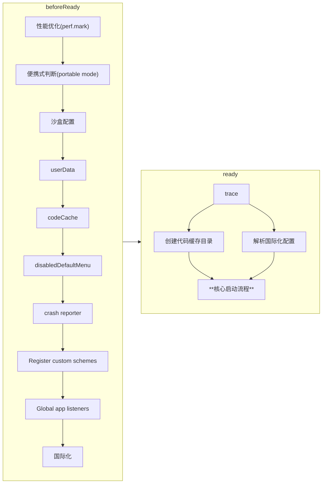

>[!note]
> It's generated by Github Copilot

# VSCode 源码解析

## src/main.ts



### 性能优化
### 便携式判断
```typescript
// Enable portable support
const portable = configurePortable(product);
...
...
// Set logs path before app 'ready' event if running portable
// to ensure that no 'logs' folder is created on disk at a
// location outside of the portable directory
// (https://github.com/microsoft/vscode/issues/56651)
if (portable && portable.isPortable) {
	app.setAppLogsPath(path.join(userDataPath, 'logs'));
}
```
### 沙盒配置

<details>

<summary>Github Copilot</summary>


> # VS Code 沙盒配置分析
> 这段代码负责配置 VS Code 中的 Electron 沙盒（sandbox）机制，这是一个重要的安全特性。
> ## 核心功能
> 这部分代码解析命令行参数并配置 Electron 相关的开关选项。
> ## 沙盒策略逻辑
> 这段代码实现了一个三路条件逻辑：
> - 启用沙盒条件：
>   - sandbox 参数为 true
>   - 未指定 disable-chromium-sandbox 命令行参数
>   - 配置文件中未设置 disable-chromium-sandbox: true
> - 特殊情况处理：
>   - 当指定了 --no-sandbox 但未指定 disable-gpu-sandbox 时，禁用 GPU 沙盒
> - 默认行为：
>   - 如果以上条件都不满足，则同时禁用普通沙盒和 GPU 沙盒
> 这是 Electron 应用程序中提高安全性的关键配置，用于隔离应用程序的不同部分，防止潜在的安全漏洞。


</details>

### UserData

<details>

<summary>Github Copilot</summary>


> # `userData` 配置代码分析
> 这段代码是 VS Code 的核心逻辑，负责设置应用程序的用户数据路径。
> ## userData 的作用
> 在 VS Code (以及所有 Electron 应用程序) 中，`userData` 目录是存储用户特定数据的关键位置，包含：
> - 用户设置和首选项
> - 已安装的扩展
> - 工作区配置
> - 应用程序状态信息
> - 临时文件和缓存
> - 日志文件
> ## 代码解析
> ```typescript
> // 在 app 'ready' 事件前设置 userData 路径
> const userDataPath = getUserDataPath(args, product.nameShort ?? 'code-oss-dev');
> if (process.platform === 'win32') {
>    const userDataUNCHost = getUNCHost(userDataPath);
>    if (userDataUNCHost) {
>        addUNCHostToAllowlist(userDataUNCHost); // 启用在 userDataPath 中使用 UNC 路径
>    }
> }
> app.setPath('userData', userDataPath);
> ```
> 这段代码执行两个主要操作：
> 1. 获取用户数据路径：调用 `getUserDataPath()` 函数，传入命令行参数和产品名称
> 2. 将该路径设置为 Electron 的 `userData` 路径
> ## 边界情况处理
> 这里也包含一个边界情况处理：Windows 平台上对 UNC 路径的特殊处理。
> **UNC 路径处理**：
> - 对于 Windows 用户，检查 userData 路径是否是网络路径(如 `\\server\share\folder`)
> - 如果是，调用 `addUNCHostToAllowlist` 函数将该网络主机添加到允许列表中
> - 这确保了 VS Code 可以正确访问存储在网络位置的用户数据
> 这个 UNC 路径处理确保 VS Code 在企业环境中正常工作，即使用户配置文件存储在网络位置。

</details>

### CodeCache

<details>

<summary>Github Copilot</summary>


> # `codeCachePath` 的作用分析
> 这段代码是 VS Code 的核心优化逻辑，用于获取代码缓存路径。
> ## 主要功能
> `codeCachePath` 用于存储 V8 JavaScript 引擎编译后的代码缓存，这是提高 VS Code 启动性能的关键机制。
> ```typescript
> // Resolve code cache path
> const codeCachePath = getCodeCachePath();
> ```
> 通过查看 `getCodeCachePath()` 函数实现，可以了解其详细逻辑：
> ```typescript
> function getCodeCachePath(): string | undefined {
> 	// 如果通过命令行参数明确禁用
> 	if (process.argv.indexOf('--no-cached-data') > 0) {
> 		return undefined;
> 	}
> 	// 开发模式下不使用缓存
> 	if (process.env['VSCODE_DEV']) {
> 		return undefined;
> 	}
> 	// 需要 commit ID
> 	const commit = product.commit;
> 	if (!commit) {
> 		return undefined;
> 	}
> 	return path.join(userDataPath, 'CachedData', commit);
> }
> ```
> ## 技术原理
> 代码缓存的工作原理：
> - 缓存 JS 代码的编译结果（字节码），避免每次启动时重新解析和编译
> - 路径包含特定的 commit ID，确保不同版本使用独立的缓存
> - 显著减少启动时间，特别是在大型应用如 VS Code 中效果明显
> ## 使用方式
> 在应用启动过程中，该路径被设置为环境变量并在后续初始化步骤中使用：
> ```typescript
> process.env['VSCODE_CODE_CACHE_PATH'] = codeCachePath || '';
> ```
> 这个优化对 VS Code 的快速启动至关重要，尤其当应用规模不断增长时。

</details>

### Disabled Default Menu

<details>

<summary>Github Copilot</summary>


> # `Menu.setApplicationMenu(null)` 分析
> 这行代码是 VSCode 的**核心逻辑**部分，而不是处理边界情况。
> ```typescript
> // Disable default menu (https://github.com/electron/electron/issues/35512)
> Menu.setApplicationMenu(null);
> ```
> ## 功能说明
> 这段代码通过将应用程序菜单设置为 `null` 来禁用 Electron 的默认菜单栏。这是 VSCode 启动流程中的一个重要步骤，因为：
> 1. VSCode 实现了自己的自定义菜单系统，不依赖 Electron 的默认菜单
> 2. 需要先禁用默认菜单，然后在应用程序的其他部分再创建和设置自定义菜单
> ## 实现原因
> 注释中引用的 GitHub issue (#35512) 说明这是有意为之的设计选择，与 Electron 默认菜单行为有关。VSCode 需要完全控制其菜单系统，以提供一致的跨平台体验和丰富的自定义选项。
> 此代码与沙盒配置、用户数据路径设置等一样，都是 VSCode 启动过程中的基础设置步骤，属于应用程序初始化阶段的核心逻辑。


</details>

### Crash Reporter
### Register custom schemes

<details>

<summary>Github Copilot</summary>


> # 自定义协议注册分析
> 这段代码是 VS Code 的**核心逻辑**，负责注册和配置 VS Code 使用的两个关键自定义 URL 协议。
> ## 功能解析
> ```typescript
> // Register custom schemes with privileges
> protocol.registerSchemesAsPrivileged([
> 	{
> 		scheme: 'vscode-webview',
> 		privileges: { standard: true, secure: true, supportFetchAPI: true, corsEnabled: true, allowServiceWorkers: true, codeCache: true }
> 	},
> 	{
> 		scheme: 'vscode-file',
> 		privileges: { secure: true, standard: true, supportFetchAPI: true, corsEnabled: true, codeCache: true }
> 	}
> ]);
> ```
> 该代码注册了两个自定义 URL 协议：
> 1. **vscode-webview**：为 VS Code 的 WebView 功能提供支持
>    - 具有完整特权集，包括 Service Worker 支持
>    - 允许 WebView 内容安全地与主进程通信
> 2. **vscode-file**：提供对本地文件的安全访问
>    - 与标准文件协议不同，具有额外安全约束
>    - 支持代码缓存以提高性能
> 这是 VS Code 架构的基础部分，没有这些自定义协议的注册，编辑器的许多核心功能（如扩展 UI、Markdown 预览、自定义编辑器等）都无法正常工作。
> 这些协议注册必须在应用初始化阶段完成，以确保 Electron 的渲染器进程能够正确识别和处理这些特殊 URL。
> Similar code found with 1 license type


</details>

### Global Listeners

<details>

<summary>Github Copilot</summary>


> # `registerListeners()` 分析
> 这段代码是 VS Code 的**核心逻辑**，负责设置全局应用程序事件监听器。
> ## 主要功能
> ```typescript
> // Global app listeners
> registerListeners();
> ```
> 这行代码调用的 `registerListeners()` 函数在 VS Code 启动过程中扮演着关键角色，它：
> 1. 注册处理文件打开请求的事件监听器
> 2. 设置 URL 协议处理的事件回调
> ## 具体实现
> 查看 `registerListeners()` 函数的完整实现：
> ```typescript
> function registerListeners(): void {
> 	/**
> 	 * macOS: when someone drops a file to the not-yet running VSCode, the open-file event fires even before
> 	 * the app-ready event. We listen very early for open-file and remember this upon startup as path to open.
> 	 */
> 	const macOpenFiles: string[] = [];
> 	(globalThis as any)['macOpenFiles'] = macOpenFiles;
> 	app.on('open-file', function(event, path) {
> 		macOpenFiles.push(path);
> 	});
> 	/**
> 	 * macOS: react to open-url requests.
> 	 */
> 	const openUrls: string[] = [];
> 	const onOpenUrl = function(event: { preventDefault: () => void }, url: string) {
> 		event.preventDefault();
> 		openUrls.push(url);
> 	};
> 	app.on('will-finish-launching', function() {
> 		app.on('open-url', onOpenUrl);
> 	});
> 	(globalThis as any)['getOpenUrls'] = function() {
> 		app.removeListener('open-url', onOpenUrl);
> 		return openUrls;
> 	};
> }
> ```
> 这是 VS Code 启动流程的核心部分，确保应用程序能够正确响应各种外部请求。


</details>

### 国际化

<details>

<summary>Github Copilot</summary>


> # VS Code 国际化配置分析
> 这段代码是 VS Code 的**核心逻辑**和**边界情况处理**的结合，负责设置应用程序的国际化（i18n）支持。
> ## 核心逻辑部分
> ```typescript
> // 可以在 app.ready 事件前解析 NLS 配置（如果在 argv.json 中已定义）
> // 否则只能在 app.ready 事件后解析 NLS，以获取 OS 区域设置
> let nlsConfigurationPromise: Promise<INLSConfiguration> | undefined = undefined;
> // 获取操作系统首选语言用于语言推荐
> // 在 Linux 上，当用户仅配置了 'C' 区域设置时，API 可能返回空数组
> // 无论哪种操作系统，如果数组为空，默认使用 'en'
> const osLocale = processZhLocale((app.getPreferredSystemLanguages()?.[0] ?? 'en').toLowerCase());
> const userLocale = getUserDefinedLocale(argvConfig);
> if (userLocale) {
> 	nlsConfigurationPromise = resolveNLSConfiguration({
> 		userLocale,
> 		osLocale,
> 		commit: product.commit,
> 		userDataPath,
> 		nlsMetadataPath: __dirname
> 	});
> }
> ```
> ## 边界情况处理
> ```typescript
> // 传入区域设置到 Electron，确保 Windows Control Overlay 在 Windows 上正确渲染
> // 由于 https://github.com/microsoft/vscode/issues/167543 问题
> // 暂时不在 macOS 上传入区域设置
> // 如果区域设置是 `qps-ploc`，表示使用的是微软伪语言包
> // 在这种情况下，使用 `en` 作为 Electron 区域设置
> if (process.platform === 'win32' || process.platform === 'linux') {
> 	const electronLocale = (!userLocale || userLocale === 'qps-ploc') ? 'en' : userLocale;
> 	app.commandLine.appendSwitch('lang', electronLocale);
> }
> ```
> 这段代码处理了几个重要的边界情况：
> 1. 中文语言特殊处理 (`processZhLocale` 函数)
> 2. 在没有找到区域设置时回退到英语
> 3. 微软伪语言包 (`qps-ploc`) 的特殊处理
> 4. macOS 平台的特殊处理（不设置区域设置）
> 这是 VS Code 作为全球化应用程序的关键部分，确保不同语言环境的用户都能获得良好体验。


</details>

### Trace

<details>

<summary>Github Copilot</summary>


> # 调试跟踪配置代码分析
> 这段代码是**边界情况处理**，专门用于支持调试和性能分析场景，而不是 VS Code 的核心运行逻辑。
> ## 功能解析
> ```typescript
> if (args['trace']) {
> 	let traceOptions: Electron.TraceConfig | Electron.TraceCategoriesAndOptions;
> 	if (args['trace-memory-infra']) {
> 		const customCategories = args['trace-category-filter']?.split(',') || [];
> 		customCategories.push('disabled-by-default-memory-infra', 'disabled-by-default-memory-infra.v8.code_stats');
> 		traceOptions = {
> 			included_categories: customCategories,
> 			excluded_categories: ['*'],
> 			memory_dump_config: {
> 				allowed_dump_modes: ['light', 'detailed'],
> 				triggers: [
> 					{
> 						type: 'periodic_interval',
> 						mode: 'detailed',
> 						min_time_between_dumps_ms: 10000
> 					},
> 					{
> 						type: 'periodic_interval',
> 						mode: 'light',
> 						min_time_between_dumps_ms: 1000
> 					}
> 				]
> 			}
> 		};
> 	} else {
> 		traceOptions = {
> 			categoryFilter: args['trace-category-filter'] || '*',
> 			traceOptions: args['trace-options'] || 'record-until-full,enable-sampling'
> 		};
> 	}
> 	contentTracing.startRecording(traceOptions).finally(() => onReady());
> } else {
> 	onReady();
> }
> ```
> 这段代码是一个特殊的调试工具，仅在使用 `--trace` 命令行参数启动 VS Code 时才会激活。它提供两种不同的跟踪配置：
> 1. **内存基础设施跟踪** (通过 `--trace-memory-infra` 启用)：
>    - 配置定期内存转储（轻量和详细两种模式）
>    - 包含特定内存相关的跟踪类别
> 2. **一般性能跟踪**：
>    - 使用命令行提供的类别过滤器或默认跟踪所有类别
>    - 允许自定义跟踪选项
> 无论是否启用跟踪，最终都会调用 `onReady()` 继续应用程序的启动流程。
> 这属于边界情况处理，因为它:
> - 仅在特定命令行参数存在时才激活
> - 服务于调试/诊断而非核心功能
> - 普通用户几乎不会使用这些参数


</details>

### startup


<details>

<summary>Github Copilot</summary>


> # `startup` 函数分析
> 这段代码是 VS Code 的**核心逻辑**，实现了 VS Code 的主要启动流程。
> ## 函数分析
> ```typescript
> /**
>  * Main startup routine
>  */
> async function startup(codeCachePath: string | undefined, nlsConfig: INLSConfiguration): Promise<void> {
> 	process.env['VSCODE_NLS_CONFIG'] = JSON.stringify(nlsConfig);
> 	process.env['VSCODE_CODE_CACHE_PATH'] = codeCachePath || '';
> 	// Bootstrap ESM
> 	await bootstrapESM();
> 	// Load Main
> 	await import('./vs/code/electron-main/main.js');
> 	perf.mark('code/didRunMainBundle');
> }
> ```
> 这个函数是 VS Code 启动的核心，执行以下几个关键步骤：
> 1. **配置环境变量**：设置国际化配置和代码缓存路径
> 2. **引导模块系统**：通过 `bootstrapESM()` 初始化 ES 模块系统
> 3. **加载主程序**：动态导入主模块 `./vs/code/electron-main/main.js`
> 4. **性能标记**：记录完成主程序包运行的性能时间点
> 这个函数本质上是应用程序启动序列的核心部分，而不是处理边缘情况的代码。它代表了 VS Code 从 Electron 层到实际应用程序加载的关键转换点。


</details>

## src/bootstrap-esm.ts

<details>

<summary>Github Copilot</summary>


> # bootstrap-esm.ts 文件分析
> ## 文件作用
> bootstrap-esm.ts 是 VS Code 核心启动过程中的关键组件，负责引导 ECMAScript 模块 (ESM) 系统并完成以下核心初始化任务：
> 1. **模块解析钩子配置**
>    - 将 'fs' 模块重定向到 'original-fs'，确保在 Electron 环境中正确处理文件系统操作
>    - 注册特殊的模块加载器以处理特定的模块解析逻辑
> 2. **全局状态初始化**
>    - 设置关键全局变量如 `_VSCODE_PRODUCT_JSON` 和 `_VSCODE_PACKAGE_JSON`
>    - 处理开发环境下的产品配置覆盖
> 3. **国际化 (NLS) 支持**
>    - 加载和配置本地化资源
>    - 处理语言包的加载和回退逻辑
>    - 记录性能指标以跟踪 NLS 加载时间
> ## 主要功能
> 文件导出一个关键函数 `bootstrapESM()`，在主应用程序启动序列中被调用：
> ```typescript
> export async function bootstrapESM(): Promise<void> {
>     // NLS
>     await setupNLS();
> }
> ```
> ## 如果缺少此文件的后果
> 如果这个文件不存在，VS Code 将无法正常启动：
> 1. **启动序列中断**
>    - main.ts 中的 `startup()` 函数直接调用 `bootstrapESM()`
>    - 缺少这个函数会导致启动流程中断
> 2. **模块加载失败**
>    - 没有 fs 模块重定向，将导致 Electron 环境中的文件系统操作不可靠
> 3. **国际化支持缺失**
>    - 无法加载语言包
>    - 所有界面将回退到默认英文，忽略用户语言首选项
> 4. **全局配置缺失**
>    - 依赖全局产品信息的代码将失败
>    - 无法正确识别产品特性和配置
> 5. **性能跟踪受损**
>    - 性能标记点缺失，影响诊断和性能分析能力
> 这个文件是 VS Code 模块化架构和启动流程的核心部分，确保应用程序的各个组件能够正确初始化和协同工作。

</details>

### 为什么要把 fs 映射到 original-fs

<details>

<summary>Github Copilot</summary>

> # Purpose of Mapping 'fs' to 'original-fs'
> This code maps the 'fs' module to 'original-fs' in Electron environments for an important reason:
> In Electron applications, the standard 'fs' module is often modified to implement security restrictions or provide sandboxed file system operations for renderer processes. These restrictions could limit VS Code's ability to perform necessary file operations.
> The 'original-fs' module in Electron provides access to the unmodified Node.js file system API with full capabilities. By redirecting 'fs' imports to 'original-fs', the code ensures VS Code can use unrestricted file system access when running in an Electron context.
> The implementation:
> 1. Only activates in Electron environments (checked with conditions)
> 2. Uses a custom ES module loader hook to intercept 'fs' imports
> 3. Redirects them to 'node:original-fs'
> This ensures VS Code maintains full file system access capabilities necessary for its core functionality like reading/writing files and working with project directories.

</details>

## src/vs/code/electron-main/main.ts
核心入口代码


