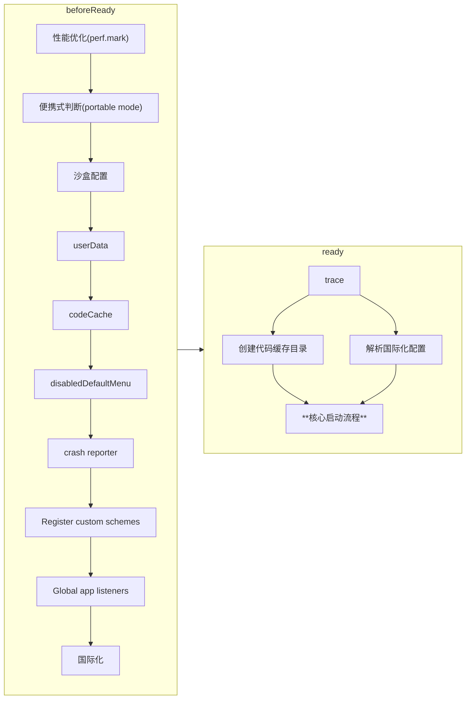

>[!note]
> It's generated by Github Copilot

# VSCode 源码解析

## src/main.ts



### 性能优化
### 便携式判断
```typescript
// Enable portable support
const portable = configurePortable(product);
...
...
// Set logs path before app 'ready' event if running portable
// to ensure that no 'logs' folder is created on disk at a
// location outside of the portable directory
// (https://github.com/microsoft/vscode/issues/56651)
if (portable && portable.isPortable) {
	app.setAppLogsPath(path.join(userDataPath, 'logs'));
}
```
### 沙盒配置

<details>

<summary>Github Copilot</summary>


> # VS Code 沙盒配置分析
> 这段代码负责配置 VS Code 中的 Electron 沙盒（sandbox）机制，这是一个重要的安全特性。
> ## 核心功能
> 这部分代码解析命令行参数并配置 Electron 相关的开关选项。
> ## 沙盒策略逻辑
> 这段代码实现了一个三路条件逻辑：
> - 启用沙盒条件：
>   - sandbox 参数为 true
>   - 未指定 disable-chromium-sandbox 命令行参数
>   - 配置文件中未设置 disable-chromium-sandbox: true
> - 特殊情况处理：
>   - 当指定了 --no-sandbox 但未指定 disable-gpu-sandbox 时，禁用 GPU 沙盒
> - 默认行为：
>   - 如果以上条件都不满足，则同时禁用普通沙盒和 GPU 沙盒
> 这是 Electron 应用程序中提高安全性的关键配置，用于隔离应用程序的不同部分，防止潜在的安全漏洞。


</details>

### UserData

<details>

<summary>Github Copilot</summary>


> # `userData` 配置代码分析
> 这段代码是 VS Code 的核心逻辑，负责设置应用程序的用户数据路径。
> ## userData 的作用
> 在 VS Code (以及所有 Electron 应用程序) 中，`userData` 目录是存储用户特定数据的关键位置，包含：
> - 用户设置和首选项
> - 已安装的扩展
> - 工作区配置
> - 应用程序状态信息
> - 临时文件和缓存
> - 日志文件
> ## 代码解析
> ```typescript
> // 在 app 'ready' 事件前设置 userData 路径
> const userDataPath = getUserDataPath(args, product.nameShort ?? 'code-oss-dev');
> if (process.platform === 'win32') {
>    const userDataUNCHost = getUNCHost(userDataPath);
>    if (userDataUNCHost) {
>        addUNCHostToAllowlist(userDataUNCHost); // 启用在 userDataPath 中使用 UNC 路径
>    }
> }
> app.setPath('userData', userDataPath);
> ```
> 这段代码执行两个主要操作：
> 1. 获取用户数据路径：调用 `getUserDataPath()` 函数，传入命令行参数和产品名称
> 2. 将该路径设置为 Electron 的 `userData` 路径
> ## 边界情况处理
> 这里也包含一个边界情况处理：Windows 平台上对 UNC 路径的特殊处理。
> **UNC 路径处理**：
> - 对于 Windows 用户，检查 userData 路径是否是网络路径(如 `\\server\share\folder`)
> - 如果是，调用 `addUNCHostToAllowlist` 函数将该网络主机添加到允许列表中
> - 这确保了 VS Code 可以正确访问存储在网络位置的用户数据
> 这个 UNC 路径处理确保 VS Code 在企业环境中正常工作，即使用户配置文件存储在网络位置。

</details>

### CodeCache

<details>

<summary>Github Copilot</summary>


> # `codeCachePath` 的作用分析
> 这段代码是 VS Code 的核心优化逻辑，用于获取代码缓存路径。
> ## 主要功能
> `codeCachePath` 用于存储 V8 JavaScript 引擎编译后的代码缓存，这是提高 VS Code 启动性能的关键机制。
> ```typescript
> // Resolve code cache path
> const codeCachePath = getCodeCachePath();
> ```
> 通过查看 `getCodeCachePath()` 函数实现，可以了解其详细逻辑：
> ```typescript
> function getCodeCachePath(): string | undefined {
> 	// 如果通过命令行参数明确禁用
> 	if (process.argv.indexOf('--no-cached-data') > 0) {
> 		return undefined;
> 	}
> 	// 开发模式下不使用缓存
> 	if (process.env['VSCODE_DEV']) {
> 		return undefined;
> 	}
> 	// 需要 commit ID
> 	const commit = product.commit;
> 	if (!commit) {
> 		return undefined;
> 	}
> 	return path.join(userDataPath, 'CachedData', commit);
> }
> ```
> ## 技术原理
> 代码缓存的工作原理：
> - 缓存 JS 代码的编译结果（字节码），避免每次启动时重新解析和编译
> - 路径包含特定的 commit ID，确保不同版本使用独立的缓存
> - 显著减少启动时间，特别是在大型应用如 VS Code 中效果明显
> ## 使用方式
> 在应用启动过程中，该路径被设置为环境变量并在后续初始化步骤中使用：
> ```typescript
> process.env['VSCODE_CODE_CACHE_PATH'] = codeCachePath || '';
> ```
> 这个优化对 VS Code 的快速启动至关重要，尤其当应用规模不断增长时。

</details>

### Disabled Default Menu

<details>

<summary>Github Copilot</summary>


> # `Menu.setApplicationMenu(null)` 分析
> 这行代码是 VSCode 的**核心逻辑**部分，而不是处理边界情况。
> ```typescript
> // Disable default menu (https://github.com/electron/electron/issues/35512)
> Menu.setApplicationMenu(null);
> ```
> ## 功能说明
> 这段代码通过将应用程序菜单设置为 `null` 来禁用 Electron 的默认菜单栏。这是 VSCode 启动流程中的一个重要步骤，因为：
> 1. VSCode 实现了自己的自定义菜单系统，不依赖 Electron 的默认菜单
> 2. 需要先禁用默认菜单，然后在应用程序的其他部分再创建和设置自定义菜单
> ## 实现原因
> 注释中引用的 GitHub issue (#35512) 说明这是有意为之的设计选择，与 Electron 默认菜单行为有关。VSCode 需要完全控制其菜单系统，以提供一致的跨平台体验和丰富的自定义选项。
> 此代码与沙盒配置、用户数据路径设置等一样，都是 VSCode 启动过程中的基础设置步骤，属于应用程序初始化阶段的核心逻辑。


</details>

### Crash Reporter
### Register custom schemes

<details>

<summary>Github Copilot</summary>


> # 自定义协议注册分析
> 这段代码是 VS Code 的**核心逻辑**，负责注册和配置 VS Code 使用的两个关键自定义 URL 协议。
> ## 功能解析
> ```typescript
> // Register custom schemes with privileges
> protocol.registerSchemesAsPrivileged([
> 	{
> 		scheme: 'vscode-webview',
> 		privileges: { standard: true, secure: true, supportFetchAPI: true, corsEnabled: true, allowServiceWorkers: true, codeCache: true }
> 	},
> 	{
> 		scheme: 'vscode-file',
> 		privileges: { secure: true, standard: true, supportFetchAPI: true, corsEnabled: true, codeCache: true }
> 	}
> ]);
> ```
> 该代码注册了两个自定义 URL 协议：
> 1. **vscode-webview**：为 VS Code 的 WebView 功能提供支持
>    - 具有完整特权集，包括 Service Worker 支持
>    - 允许 WebView 内容安全地与主进程通信
> 2. **vscode-file**：提供对本地文件的安全访问
>    - 与标准文件协议不同，具有额外安全约束
>    - 支持代码缓存以提高性能
> 这是 VS Code 架构的基础部分，没有这些自定义协议的注册，编辑器的许多核心功能（如扩展 UI、Markdown 预览、自定义编辑器等）都无法正常工作。
> 这些协议注册必须在应用初始化阶段完成，以确保 Electron 的渲染器进程能够正确识别和处理这些特殊 URL。
> Similar code found with 1 license type


</details>

### Global Listeners

<details>

<summary>Github Copilot</summary>


> # `registerListeners()` 分析
> 这段代码是 VS Code 的**核心逻辑**，负责设置全局应用程序事件监听器。
> ## 主要功能
> ```typescript
> // Global app listeners
> registerListeners();
> ```
> 这行代码调用的 `registerListeners()` 函数在 VS Code 启动过程中扮演着关键角色，它：
> 1. 注册处理文件打开请求的事件监听器
> 2. 设置 URL 协议处理的事件回调
> ## 具体实现
> 查看 `registerListeners()` 函数的完整实现：
> ```typescript
> function registerListeners(): void {
> 	/**
> 	 * macOS: when someone drops a file to the not-yet running VSCode, the open-file event fires even before
> 	 * the app-ready event. We listen very early for open-file and remember this upon startup as path to open.
> 	 */
> 	const macOpenFiles: string[] = [];
> 	(globalThis as any)['macOpenFiles'] = macOpenFiles;
> 	app.on('open-file', function(event, path) {
> 		macOpenFiles.push(path);
> 	});
> 	/**
> 	 * macOS: react to open-url requests.
> 	 */
> 	const openUrls: string[] = [];
> 	const onOpenUrl = function(event: { preventDefault: () => void }, url: string) {
> 		event.preventDefault();
> 		openUrls.push(url);
> 	};
> 	app.on('will-finish-launching', function() {
> 		app.on('open-url', onOpenUrl);
> 	});
> 	(globalThis as any)['getOpenUrls'] = function() {
> 		app.removeListener('open-url', onOpenUrl);
> 		return openUrls;
> 	};
> }
> ```
> 这是 VS Code 启动流程的核心部分，确保应用程序能够正确响应各种外部请求。


</details>

### 国际化

<details>

<summary>Github Copilot</summary>


> # VS Code 国际化配置分析
> 这段代码是 VS Code 的**核心逻辑**和**边界情况处理**的结合，负责设置应用程序的国际化（i18n）支持。
> ## 核心逻辑部分
> ```typescript
> // 可以在 app.ready 事件前解析 NLS 配置（如果在 argv.json 中已定义）
> // 否则只能在 app.ready 事件后解析 NLS，以获取 OS 区域设置
> let nlsConfigurationPromise: Promise<INLSConfiguration> | undefined = undefined;
> // 获取操作系统首选语言用于语言推荐
> // 在 Linux 上，当用户仅配置了 'C' 区域设置时，API 可能返回空数组
> // 无论哪种操作系统，如果数组为空，默认使用 'en'
> const osLocale = processZhLocale((app.getPreferredSystemLanguages()?.[0] ?? 'en').toLowerCase());
> const userLocale = getUserDefinedLocale(argvConfig);
> if (userLocale) {
> 	nlsConfigurationPromise = resolveNLSConfiguration({
> 		userLocale,
> 		osLocale,
> 		commit: product.commit,
> 		userDataPath,
> 		nlsMetadataPath: __dirname
> 	});
> }
> ```
> ## 边界情况处理
> ```typescript
> // 传入区域设置到 Electron，确保 Windows Control Overlay 在 Windows 上正确渲染
> // 由于 https://github.com/microsoft/vscode/issues/167543 问题
> // 暂时不在 macOS 上传入区域设置
> // 如果区域设置是 `qps-ploc`，表示使用的是微软伪语言包
> // 在这种情况下，使用 `en` 作为 Electron 区域设置
> if (process.platform === 'win32' || process.platform === 'linux') {
> 	const electronLocale = (!userLocale || userLocale === 'qps-ploc') ? 'en' : userLocale;
> 	app.commandLine.appendSwitch('lang', electronLocale);
> }
> ```
> 这段代码处理了几个重要的边界情况：
> 1. 中文语言特殊处理 (`processZhLocale` 函数)
> 2. 在没有找到区域设置时回退到英语
> 3. 微软伪语言包 (`qps-ploc`) 的特殊处理
> 4. macOS 平台的特殊处理（不设置区域设置）
> 这是 VS Code 作为全球化应用程序的关键部分，确保不同语言环境的用户都能获得良好体验。


</details>

### Trace

<details>

<summary>Github Copilot</summary>


> # 调试跟踪配置代码分析
> 这段代码是**边界情况处理**，专门用于支持调试和性能分析场景，而不是 VS Code 的核心运行逻辑。
> ## 功能解析
> ```typescript
> if (args['trace']) {
> 	let traceOptions: Electron.TraceConfig | Electron.TraceCategoriesAndOptions;
> 	if (args['trace-memory-infra']) {
> 		const customCategories = args['trace-category-filter']?.split(',') || [];
> 		customCategories.push('disabled-by-default-memory-infra', 'disabled-by-default-memory-infra.v8.code_stats');
> 		traceOptions = {
> 			included_categories: customCategories,
> 			excluded_categories: ['*'],
> 			memory_dump_config: {
> 				allowed_dump_modes: ['light', 'detailed'],
> 				triggers: [
> 					{
> 						type: 'periodic_interval',
> 						mode: 'detailed',
> 						min_time_between_dumps_ms: 10000
> 					},
> 					{
> 						type: 'periodic_interval',
> 						mode: 'light',
> 						min_time_between_dumps_ms: 1000
> 					}
> 				]
> 			}
> 		};
> 	} else {
> 		traceOptions = {
> 			categoryFilter: args['trace-category-filter'] || '*',
> 			traceOptions: args['trace-options'] || 'record-until-full,enable-sampling'
> 		};
> 	}
> 	contentTracing.startRecording(traceOptions).finally(() => onReady());
> } else {
> 	onReady();
> }
> ```
> 这段代码是一个特殊的调试工具，仅在使用 `--trace` 命令行参数启动 VS Code 时才会激活。它提供两种不同的跟踪配置：
> 1. **内存基础设施跟踪** (通过 `--trace-memory-infra` 启用)：
>    - 配置定期内存转储（轻量和详细两种模式）
>    - 包含特定内存相关的跟踪类别
> 2. **一般性能跟踪**：
>    - 使用命令行提供的类别过滤器或默认跟踪所有类别
>    - 允许自定义跟踪选项
> 无论是否启用跟踪，最终都会调用 `onReady()` 继续应用程序的启动流程。
> 这属于边界情况处理，因为它:
> - 仅在特定命令行参数存在时才激活
> - 服务于调试/诊断而非核心功能
> - 普通用户几乎不会使用这些参数


</details>

### startup


<details>

<summary>Github Copilot</summary>


> # `startup` 函数分析
> 这段代码是 VS Code 的**核心逻辑**，实现了 VS Code 的主要启动流程。
> ## 函数分析
> ```typescript
> /**
>  * Main startup routine
>  */
> async function startup(codeCachePath: string | undefined, nlsConfig: INLSConfiguration): Promise<void> {
> 	process.env['VSCODE_NLS_CONFIG'] = JSON.stringify(nlsConfig);
> 	process.env['VSCODE_CODE_CACHE_PATH'] = codeCachePath || '';
> 	// Bootstrap ESM
> 	await bootstrapESM();
> 	// Load Main
> 	await import('./vs/code/electron-main/main.js');
> 	perf.mark('code/didRunMainBundle');
> }
> ```
> 这个函数是 VS Code 启动的核心，执行以下几个关键步骤：
> 1. **配置环境变量**：设置国际化配置和代码缓存路径
> 2. **引导模块系统**：通过 `bootstrapESM()` 初始化 ES 模块系统
> 3. **加载主程序**：动态导入主模块 `./vs/code/electron-main/main.js`
> 4. **性能标记**：记录完成主程序包运行的性能时间点
> 这个函数本质上是应用程序启动序列的核心部分，而不是处理边缘情况的代码。它代表了 VS Code 从 Electron 层到实际应用程序加载的关键转换点。


</details>

## src/bootstrap-esm.ts

<details>

<summary>Github Copilot</summary>


> # bootstrap-esm.ts 文件分析
> ## 文件作用
> bootstrap-esm.ts 是 VS Code 核心启动过程中的关键组件，负责引导 ECMAScript 模块 (ESM) 系统并完成以下核心初始化任务：
> 1. **模块解析钩子配置**
>    - 将 'fs' 模块重定向到 'original-fs'，确保在 Electron 环境中正确处理文件系统操作
>    - 注册特殊的模块加载器以处理特定的模块解析逻辑
> 2. **全局状态初始化**
>    - 设置关键全局变量如 `_VSCODE_PRODUCT_JSON` 和 `_VSCODE_PACKAGE_JSON`
>    - 处理开发环境下的产品配置覆盖
> 3. **国际化 (NLS) 支持**
>    - 加载和配置本地化资源
>    - 处理语言包的加载和回退逻辑
>    - 记录性能指标以跟踪 NLS 加载时间
> ## 主要功能
> 文件导出一个关键函数 `bootstrapESM()`，在主应用程序启动序列中被调用：
> ```typescript
> export async function bootstrapESM(): Promise<void> {
>     // NLS
>     await setupNLS();
> }
> ```
> ## 如果缺少此文件的后果
> 如果这个文件不存在，VS Code 将无法正常启动：
> 1. **启动序列中断**
>    - main.ts 中的 `startup()` 函数直接调用 `bootstrapESM()`
>    - 缺少这个函数会导致启动流程中断
> 2. **模块加载失败**
>    - 没有 fs 模块重定向，将导致 Electron 环境中的文件系统操作不可靠
> 3. **国际化支持缺失**
>    - 无法加载语言包
>    - 所有界面将回退到默认英文，忽略用户语言首选项
> 4. **全局配置缺失**
>    - 依赖全局产品信息的代码将失败
>    - 无法正确识别产品特性和配置
> 5. **性能跟踪受损**
>    - 性能标记点缺失，影响诊断和性能分析能力
> 这个文件是 VS Code 模块化架构和启动流程的核心部分，确保应用程序的各个组件能够正确初始化和协同工作。

</details>

### 为什么要把 fs 映射到 original-fs

<details>

<summary>Github Copilot</summary>

> # Purpose of Mapping 'fs' to 'original-fs'
> This code maps the 'fs' module to 'original-fs' in Electron environments for an important reason:
> In Electron applications, the standard 'fs' module is often modified to implement security restrictions or provide sandboxed file system operations for renderer processes. These restrictions could limit VS Code's ability to perform necessary file operations.
> The 'original-fs' module in Electron provides access to the unmodified Node.js file system API with full capabilities. By redirecting 'fs' imports to 'original-fs', the code ensures VS Code can use unrestricted file system access when running in an Electron context.
> The implementation:
> 1. Only activates in Electron environments (checked with conditions)
> 2. Uses a custom ES module loader hook to intercept 'fs' imports
> 3. Redirects them to 'node:original-fs'
> This ensures VS Code maintains full file system access capabilities necessary for its core functionality like reading/writing files and working with project directories.

</details>

## src/vs/code/electron-main/main.ts
核心入口代码


## src/vs/code/electron-main/main.ts#CodeApplication.startup

在 startup 中触发 CodeApplication 实例上的 startup 方法。该方法做了如下事情：


### 唯一标识符

> 它们对于设置同步等功能特别重要，在这些功能中，正确识别不同的机器对于跨多个设备同步用户数据至关重要。

### 初始化ipc


<details>

<summary>Github Copilot</summary>

 
> # initChannels 方法的作用
> `initChannels` 方法在 VS Code 的主进程中负责初始化和注册进程间通信(IPC)通道。这些通道使 VS Code 的主进程能够与其他进程(如渲染进> 程和共享进程)进行通信。
> ## 主要功能
> 1. **创建通信桥梁**：为 VS Code 的各个组件之间建立通信机制
> 2. **注册服务通道**：将主进程中的各种服务转换为可通过 IPC 访问的通道
> ## 注册的通道类型
> 方法将通道注册到三个不同的目标：
> 1. **mainProcessNodeIpcServer**：用于第一个和第二个 VS Code 实例之间的通信
> 2. **mainProcessElectronServer**：用于主进程与渲染进程之间的通信
> 3. **sharedProcessClient**：用于主进程与共享进程之间的通信
> ## 注册的重要服务通道
> 该方法注册了大量服务通道，包括：
> - **系统功能**：启动(`launch`)、更新(`update`)、进程管理(`process`)
> - **文件操作**：本地文件系统访问
> - **安全与加密**：加密服务、签名服务、策略管理
> - **UI组件**：菜单栏、Webview管理
> - **数据管理**：存储服务、用户数据配置文件
> - **开发工具**：诊断服务、日志记录、扩展主机调试
> - **终端相关**：终端服务、外部终端集成
> 通过这种通道设计，VS Code 实现了一个模块化的架构，其中不同的进程可以安全地访问彼此的功能，而无需共享内存空间，提高了应用程序的稳定性和可扩展性。


</details>

### 打开首个窗口


<details>

<summary>Github Copilot</summary>


> # openFirstWindow 方法详解
> `openFirstWindow` 方法是 VS Code 启动过程中的关键环节，负责决定首次启动时应该打开什么内容。这个方法需要处理多种启动场景，包括从协议链接、命令行参数、系统事件等各种方式启动 VS Code 时应该展示什么内容。
> ## 方法整体作用
> 此方法负责确定并打开 VS Code 启动时用户看到的第一个窗口，包括:
> - 决定打开空窗口还是特定内容
> - 处理通过协议链接（如 vscode:// URL）启动的情况
> - 响应命令行参数
> - 处理操作系统特定的文件打开事件（特别是 macOS）
> ## 分支判断详解
> 方法包含多个 if-else 分支，每个分支处理不同的启动场景：
> ### 1. 协议 URL 启动分支
> ```typescript
> if (initialProtocolUrls) {
>     // 子分支1: 可直接作为窗口打开的 URL
>     if (initialProtocolUrls.openables.length > 0) {
>         // 打开协议 URL 指定的文件/文件夹/工作区
>     }
>     // 子分支2: 请求在新窗口中处理的协议 URL
>     if (initialProtocolUrls.urls.length > 0) {
>         for (const protocolUrl of initialProtocolUrls.urls) {
>             if (params.get('windowId') === '_blank') {
>                 // 打开空白窗口，稍后处理此 URL
>             }
>         }
>     }
> }
> ```
> **示例**:
> - 当用户点击 `vscode://file/path/to/project` 链接时，VS Code 会启动并直接打开该项目
> - 当扩展请求在新窗口中打开内容时，如 `vscode://vscode.github-authentication?windowId=_blank`
> ### 2. 无文件/文件夹参数启动分支
> ```typescript
> if (!hasCliArgs && !hasFolderURIs && !hasFileURIs) {
>     // 子分支1: 强制新窗口
>     if (args['new-window'] || forceProfile || forceTempProfile) {
>         // 打开空白新窗口
>     }
>     // 子分支2: macOS 特定处理
>     if (macOpenFiles.length) {
>         // 打开通过 Finder 拖放或"打开方式"选择的文件
>     }
> }
> ```
> **示例**:
> - 用户通过 `code --new-window` 命令启动，将打开一个空白窗口
> - 用户指定特定配置文件启动 `code --profile myprofile`，将打开空白窗口使用该配置
> - 在 macOS 上，用户将文件拖到 VS Code 图标上启动应用
> ### 3. 默认启动分支（有命令行参数）
> ```typescript
> // 默认行为：从命令行读取路径
> return windowsMainService.open({
>     // 各种参数...
> });
> ```
> **示例**:
> - 用户执行 `code /path/to/project` 将直接打开该项目
> - 用户执行 `code --diff file1 file2` 将在差异模式下打开两个文件
> - 用户执行 `code file.txt:42` 将打开文件并跳转到第42行
> ## 总结
> `openFirstWindow` 方法是 VS Code 启动体验的核心，它处理了多种不同的启动场景，确保无论用户如何启动 VS Code，都能获得一致且符合预期的体验。这种灵活性使 VS Code 能够无缝集成到不同的工作流程和操作系统环境中。

</details>

## src/vs/platform/windows/electron-main/windowsMainService.ts#WindowsMainService.open


<details>

<summary>Github Copilot</summary>

> # VS Code 的 open 方法详解
> `open` 方法是 VS Code 窗口管理系统中的核心方法，负责处理各种内容的打开逻辑，包括文件、文件夹和工作区。这个方法位于 `WindowsMainService` 类中，是所有窗口打开操作的中央控制器。
> ## 核心功能
> 这个方法的主要职责是：
> 1. **确定要打开的内容**：解析用户想要打开的内容（文件、文件夹、工作区）
> 2. **决定打开方式**：确定内容应该在新窗口还是现有窗口中打开
> 3. **处理窗口状态**：管理窗口的创建、重用和焦点
> 4. **支持特殊模式**：处理差异比较、合并文件、命令行等待等特殊模式
> ## 方法参数
> ```typescript
> async open(openConfig: IOpenConfiguration): Promise<ICodeWindow[]>
> ```
> `openConfig` 参数包含了控制打开行为的所有配置，如：
> - 打开上下文（CLI、桌面、菜单等）
> - 命令行参数
> - 是否应该在新窗口打开
> - 是否为添加/移除文件夹模式
> - 要打开的 URI 列表
> ## 主要流程
> 1. **路径收集**：调用 `getPathsToOpen` 收集所有要打开的路径
>    ```typescript
>    const pathsToOpen = await this.getPathsToOpen(openConfig);
>    ```
> 2. **路径分类**：将收集到的路径分类为文件夹、工作区、文件等
>    ```typescript
>    for (const path of pathsToOpen) {
>      if (isSingleFolderWorkspacePathToOpen(path)) {
>        // 处理文件夹...
>      } else if (isWorkspacePathToOpen(path)) {
>        // 处理工作区...
>      } else if (path.fileUri) {
>        // 处理文件...
>      }
>    }
>    ```
> 3. **特殊模式处理**：
>    ```typescript
>    // 差异比较模式
>    if (openConfig.diffMode && filesToOpen && filesToOpen.filesToOpenOrCreate.length >= 2) {
>      filesToOpen.filesToDiff = filesToOpen.filesToOpenOrCreate.slice(0, 2);
>      filesToOpen.filesToOpenOrCreate = [];
>    }
>    
>    // 合并模式
>    if (openConfig.mergeMode && filesToOpen && filesToOpen.filesToOpenOrCreate.length === 4) {
>      filesToOpen.filesToMerge = filesToOpen.filesToOpenOrCreate.slice(0, 4);
>      // ...
>    }
>    ```
> 4. **执行打开操作**：调用 `doOpen` 方法实际打开窗口
>    ```typescript
>    const { windows: usedWindows, filesOpenedInWindow } = await this.doOpen(openConfig, workspacesToOpen, foldersToOpen, /* ... */);
>    ```
> 5. **焦点管理**：确定哪个窗口应该获得焦点
>    ```typescript
>    if (usedWindows.length > 1) {
>      // 有多个窗口时的焦点逻辑
>      if (filesOpenedInWindow) {
>        filesOpenedInWindow.focus();
>      } else {
>        // 其他焦点分配逻辑
>      }
>    }
>    ```
> 6. **记录历史**：添加到最近打开的历史记录中
>    ```typescript
>    this.workspacesHistoryMainService.addRecentlyOpened(recents);
>    ```
> ## 主要场景
> `open` 方法处理的场景包括：
> 1. **从命令行打开**：处理 `code file.txt` 或 `code folder/` 等命令
> 2. **从 GUI 打开**：处理从文件资源管理器、Dock 等打开的情况
> 3. **会话恢复**：启动时恢复上次的窗口
> 4. **差异比较**：使用 `--diff` 比较两个文件
> 5. **文件合并**：使用 `--merge` 合并文件
> 6. **远程开发**：处理远程开发场景下的窗口打开
> 总之，`open` 方法是 VS Code 窗口系统的核心入口点，协调了所有窗口打开操作，确保用户体验的一致性和可预测性。

</details>

## src/vs/platform/windows/electron-main/windowsMainService.ts#WindowsMainService.doOpen

> [!note]
> 如 Copilot 所说，这个方法里通过各种判断，会触发不同的方法，除了 `openInBrowserWindow` 是打开一个 window，其余都是在已存在的 window 中打开文件，故后续代码从 `openInBrowserWindow` 作为切入点。


<details>

<summary>Github Copilot</summary>

> # WindowsMainService 中 doOpen 方法详解
> `doOpen` 方法是 VSCode 窗口管理系统的核心实现，负责协调和处理所有打开内容（工作区、文件夹、文件）的复杂逻辑。它处理的是 "怎么打开" 的问题 —— 即确定内容应该在哪个窗口中打开。
> ## 核心功能
> 这个方法接收已经解析好的各种内容路径，然后决定:
> 1. 是否使用现有窗口
> 2. 是否需要创建新窗口
> 3. 如何在多窗口之间分配内容
> ## 方法参数
> ```typescript
> private async doOpen(
>     openConfig: IOpenConfiguration,           // 打开的配置选项
>     workspacesToOpen: IWorkspacePathToOpen[], // 要打开的工作区
>     foldersToOpen: ISingleFolderWorkspacePathToOpen[], // 要打开的文件夹
>     emptyToRestore: IEmptyWindowBackupInfo[], // 要恢复的空窗口备份
>     maybeOpenEmptyWindow: boolean,            // 是否可能需要打开空窗口
>     filesToOpen: IFilesToOpen | undefined,    // 要打开的文件
>     foldersToAdd: ISingleFolderWorkspacePathToOpen[], // 要添加到现有窗口的文件夹
>     foldersToRemove: ISingleFolderWorkspacePathToOpen[] // 要从现有窗口移除的文件夹
> ): Promise<{ windows: ICodeWindow[]; filesOpenedInWindow: ICodeWindow | undefined }>
> ```
> ## 工作流程
> 方法按照特定的顺序和优先级处理各种打开场景：
> 1. **处理文件夹添加/移除**：
>    - 查找合适的活动窗口并在其中添加/移除文件夹
> 2. **处理文件打开**：
>    - 如果没有要打开的工作区/文件夹，则查找最合适的窗口来打开文件
>    - 使用多种策略来找到最佳窗口（如检查文件所属工作区、使用最后活动窗口等）
>    - 如果找不到合适窗口，则创建新窗口
> 3. **处理工作区打开**：
>    - 检查是否已有窗口打开了该工作区
>    - 对未打开的工作区，创建新窗口或复用现有窗口（根据配置决定）
> 4. **处理文件夹打开**：
>    - 检查是否已有窗口打开了该文件夹
>    - 对未打开的文件夹，创建新窗口或复用现有窗口（根据配置决定）
> 5. **处理空窗口恢复**：
>    - 根据备份信息恢复之前的空窗口状态（如崩溃恢复）
> 6. **处理空窗口打开**：
>    - 如果还有未打开的文件，或用户要求打开空窗口，或没有打开任何窗口，则打开空窗口
> ## 返回结果
> 方法返回两个重要信息：
> 1. 所有使用或创建的窗口列表
> 2. 打开文件的窗口（如果有的话）
> 这些信息被传回调用者，用于后续操作如设置焦点窗口、处理等待标记等。
> 总之，`doOpen` 方法是 VSCode 窗口管理的核心逻辑，处理了各种复杂的打开场景，确保内容以最合适的方式打开，同时遵守用户配置和应用程序状态。

</details>

## src/vs/platform/windows/electron-main/windowsMainService.ts#WindowsMainService.openInBrowserWindow

> [!note]
> 在 VSCode 中 `this.instantiationService.createInstance(Ctor, { xxx })` 这种代码等价于 `new Ctor({})`。因为要处理 IOC，可以参考 [vscode-service](./vscode-service.md)


<details>

<summary>Github Copilot</summary>

> # VS Code 的 openInBrowserWindow 方法详解
> `openInBrowserWindow` 方法是 VS Code 窗口管理系统的核心方法，负责实际创建或重用 Electron 窗口来打开 VS Code 内容。这是最低层的窗口创建逻辑，处理所有与 Electron 窗口相关的配置和生命周期。
> ## 主要功能
> 该方法接收 `IOpenBrowserWindowOptions` 参数，包含要打开的内容和窗口行为的配置信息，最终返回一个已配置并加载的 `ICodeWindow` 实例。
> 主要职责包括：
> 1. **窗口创建与重用决策**
>    - 根据参数决定是创建新窗口还是重用现有窗口
>    - 处理窗口选项卡管理（macOS）
> 2. **窗口配置构建**
>    - 生成完整的窗口配置（`INativeWindowConfiguration`）
>    - 包括命令行参数、机器标识、路径配置、用户环境变量等
>    - 配置工作区、文件、差异比较、合并等目标
> 3. **窗口备份与恢复**
>    - 通过 `backupMainService` 注册工作区、文件夹或空窗口的备份
>    - 支持崩溃恢复和会话还原
> 4. **用户配置文件管理**
>    - 解析并应用适当的用户配置文件（profile）
>    - 处理强制配置文件和临时配置文件情况
>    - 将配置文件与工作区关联
> 5. **窗口生命周期与事件管理**
>    - 注册窗口事件（就绪、关闭、销毁等）
>    - 维护窗口计数和窗口列表
>    - 处理最大化、全屏等状态变化
> ## 执行流程
> 1. 首先尝试确定要使用的配置文件（默认、新窗口或强制指定）
> 2. 根据传入参数决定是重用现有窗口还是创建新窗口
> 3. 构建完整的窗口配置
> 4. 对于新窗口：创建实例、注册事件、添加到窗口列表
> 5. 对于现有窗口：处理配置继承，特别是扩展开发相关的设置
> 6. 注册备份路径（用于崩溃恢复）
> 7. 解析并设置用户配置文件
> 8. 使用配置加载窗口
> 这个方法是整个 VS Code 窗口系统的基石，确保窗口按照正确且一致的方式创建和加载，同时支持崩溃恢复和会话保存等高级功能。

</details>

### doOpenInBrowserWindow

<details>

<summary>Github Copilot</summary>

> # VS Code 的 doOpenInBrowserWindow 方法详解
> `doOpenInBrowserWindow` 方法是 VS Code 窗口系统中的核心方法，负责将配置应用到浏览器窗口并完成窗口加载过程。这是 `openInBrowserWindow` 方法的后半部分逻辑，处理的是窗口配置的完成和实际加载操作。
> ## 主要功能
> 此方法执行以下关键操作：
> 1. **备份路径注册**：为不同类型的窗口内容创建和注册备份路径
>    ```typescript
>    if (!configuration.extensionDevelopmentPath) {
>        if (isWorkspaceIdentifier(configuration.workspace)) {
>            configuration.backupPath = this.backupMainService.registerWorkspaceBackup({
>                workspace: configuration.workspace,
>                remoteAuthority: configuration.remoteAuthority
>            });
>        } else if (isSingleFolderWorkspaceIdentifier(configuration.workspace)) {
>            // 为单文件夹工作区注册备份
>        } else {
>            // 为空窗口注册备份
>        }
>    }
>    ```
> 2. **用户配置文件解析**：确定应该使用哪个用户配置文件
>    ```typescript
>    const workspace = configuration.workspace ?? toWorkspaceIdentifier(configuration.backupPath, false);
>    const profilePromise = this.resolveProfileForBrowserWindow(options, workspace, defaultProfile);
>    const profile = profilePromise instanceof Promise ? await profilePromise : profilePromise;
>    configuration.profiles.profile = profile;
>    ```
> 3. **配置文件关联**：将配置文件与工作区永久关联（除非是扩展开发窗口）
>    ```typescript
>    if (!configuration.extensionDevelopmentPath) {
>        await this.userDataProfilesMainService.setProfileForWorkspace(workspace, profile);
>    }
>    ```
> 4. **窗口加载**：使用完整配置加载窗口
>    ```typescript
>    window.load(configuration);
>    ```
> ## 工作流程
> 1. 首先，如果窗口不是用于扩展开发，会根据内容类型（工作区、文件夹或空窗口）注册相应的备份
> 2. 然后，解析当前应用的用户配置文件（考虑强制配置文件和临时配置文件选项）
> 3. 将配置文件与工作区关联，便于下次自动使用相同配置
> 4. 最终，将完整配置应用到窗口并触发加载
> 这个方法是 VS Code 窗口生命周期中关键的一步，它确保窗口有正确的备份路径、用户配置文件以及与工作区的持久关联，这些都是 VS Code 用户体验的重要部分。
</details>

### src/vs/platform/windows/electron-main/windowImpl.ts#load


```ts
// 处理配置及状态更新
...
this._win.loadURL(FileAccess.asBrowserUri(`vs/code/electron-sandbox/workbench/workbench${this.environmentMainService.isBuilt ? '' : '-dev'}.html`).toString(true));
...
// 状态更新及事件触发

```

<details>

<summary>Github Copilot</summary>

> # VS Code 中 `load` 方法的作用详解
> `load` 方法是 `CodeWindow` 类中的核心方法，负责配置并加载 VS Code 窗口的内容。这个方法处理从准备窗口状态到实际加载 Web 内容的整个过程。
> ## 主要功能
> 1. **窗口状态清理**：
>    - 清除文档的"已编辑"状态（如果需要）
>    - 清除窗口标题和代表文件名（如果不是重新加载）
> 2. **配置处理**：
>    - 通过 `updateConfiguration` 更新基于当前窗口上下文的配置值
>    - 将配置放入配置对象 URL 中，供渲染进程使用
> 3. **配置关联逻辑**：
>    - 如果是窗口第一次加载（`readyState === ReadyState.NONE`），直接将配置与窗口关联
>    - 如果窗口已经显示内容，将配置存储为待处理配置（`pendingLoadConfig`），等待窗口加载事件触发后再关联
> 4. **状态转换**：
>    - 将窗口的 `readyState` 设置为 `NAVIGATING`，表示窗口正在导航中
> 5. **加载 Web 内容**：
>    - 加载 VS Code 的主界面 HTML 文件（workbench.html）
> 6. **加载状态记录**：
>    - 记录窗口已经被加载过（`wasLoaded = true`）
> 7. **安全措施**：
>    - 在开发模式下，设置一个定时器，如果窗口在特定时间内没有变为可见，则强制显示窗口并打开开发者工具
> 8. **事件触发**：
>    - 触发 `onWillLoad` 事件，通知其他组件窗口即将加载
> ## 为什么这个方法很重要
> `load` 方法是 VS Code 窗口生命周期中的关键环节，它：
> 1. 连接了命令行参数、配置系统和实际的窗口内容
> 2. 处理了首次加载和重新加载的不同逻辑
> 3. 确保窗口状态的正确性和一致性
> 4. 管理渲染进程与主进程之间的配置传递
> 总的来说，`load` 方法是窗口显示内容前的"准备阶段"，它设置了必要的状态和配置，然后触发实际的内容加载过程。

</details>

